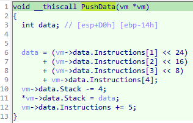
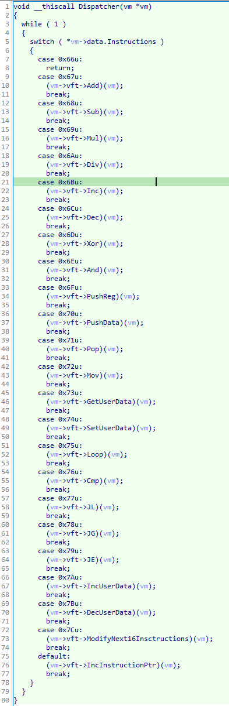

# vm_crackme

## Input file

- Filename: vm_crackme.exe
- Source: hxxps[://]github[.]com/zzz66686/simple-virtual-machine/tree/master/VM_crackme

## Analysis

### Analysis of the input file

Let's start by checking the input file in DetectItEasy, if there are any known safeguards.

|  |
|:--:|
| *DIE result for input file* |

Nothing special, so it's time to switch to IDA.

|  |
|:--:|
| *Main function* |

At first glance, we can see that the program expects a password from argv, allocates memory and then executes functions that look like functions from a virtual functions table.

|  |
|:--:|
| *Virtual functions table* |

Digging deeper into the code, we can see the VFT and the functions that assign the VFT to a pointer in the struct, so let's start our analysis with the 3 functions that are called from main!

|  |
|:--:|
| *1st virtual function called* |

Let's start with the first called function with VFT *(*(*v10 + 104))* - which looks like an assignment of the initial state of vm. 

|  |
|:--:|
| *2nd virtual function called* |

The next called function from VFT *(*(*v10 + 112))* looks like a dispatcher - presumably this is the main loop of the virtual machine.

|  |
|:--:|
| *3rd virtual function called* |

The last called function from VFT *(*(*v10 + 108))* assigns values that were probably modified through the main loop of the virtual machine. The result is checked in the following "if", which determines whether we guessed the password. 

After a while, I realized that these functions are used to initialize the VM, execute its code, and then collect the results. So let's create structures to describe the VM! At first I described the structures associated with the first and last functions called from main because they were simple, and I will leave the "Dispatcher" functions until I describe the VFT.

At this stage, I found the presence of 5 registers (4 ordinary and 1 associated with the control-flow), 18 functions used in the execution of the VM, and a array of bytes that contains the "righteous code", which can be understood as "Instructions".

|  |
|:--:|
| *1st virtual function called, describe* |

|  |
|:--:|
| *3rd virtual function called, describe* |

So I noticed that the first 3 and the last 3 functions from VFT are not called directly from the dispatcher function, so let's analyze the first 3 because the last 3 are called from *main*. 

|  |
|:--:|
| *1st virtual function* |

The first function takes the upper 4 bits of the next byte from an array named "Instructions" and relative to this value returns a register. 

|  |
|:--:|
| *2nd virtual function* |

The second function differs from the above in that it takes the lower 4 bits of the next "Instruction" byte and relative to them returns the register.

|  |
|:--:|
| *3rd virtual function* |

The third function from the VFT takes the top 4 bits from the next byte of the "Instruction" and then sets the value of the dependent register by assigning it the passed argument.

Knowing that these 3 functions are responsible for decoding the selected registers against the given 'Instructions', so we can start analyzing the other functions from the VFT!

|  |
|:--:|
| *Add implementation in VFT* |

|  |
|:--:|
| *Sub implementation in VFT* |

|  |
|:--:|
| *Mul implementation in VFT* |

|  |
|:--:|
| *Div implementation in VFT* |

|  |
|:--:|
| *Inc implementation in VFT* |

|  |
|:--:|
| *Dec implementation in VFT* |

|  |
|:--:|
| *Xor implementation in VFT* |

|  |
|:--:|
| *And implementation in VFT* |

|  |
|:--:|
| *Pushing register value on the stack* |

|  |
|:--:|
| *Pushing data on the stack* |

|  |
|:--:|
| *Pop implementation in VFT* |

|  |
|:--:|
| *Mov implementation in VFT* |

|  |
|:--:|
| *Retrieving data from user input* |

|  |
|:--:|
| *Assignment data to user input data* |

|  |
|:--:|
| *Loop implementation in VFT* |

|  |
|:--:|
| *Cmp implementation in VFT* |

|  |
|:--:|
| *JL implementation in VFT* |

|  |
|:--:|
| *JG implementation in VFT* |

|  |
|:--:|
| *JE implementation in VFT* |

|  |
|:--:|
| *Increasing user input pointer* |

|  |
|:--:|
| *Decreasing user input pointer* |

|  |
|:--:|
| *Modifying the next 16 instructions* |

|  |
|:--:|
| *Increasing the current instruction pointer* |

We specify the approximate equivalents of assembly mnemonics that are implemented by the VM. Their assignment to the structure describing the VFT shows the actual appearance of the "Dispatcher" function.

|  |
|:--:|
| *Dispatcher function, 2nd called function from main* |

The above analysis allowed us to define the functions used by the VM, the structure of the VM and how to interpret "Instructions".

```
[OPCODE] [OPERAND]
[1 BYTE] [0-5 BYTES]

OPCODE  -> DISPATCHER OPERATES ON IT, CONTAINS OPERATION TYPE
OPERAND -> FUNCTIONS FROM VFT OPERATES ON IT

OPERAND CAN CONTAINS:
- ENCODED REGISTERS,
- DATA,
- JUMP OFFSET.
```

| *Construction of a single VM instruction* |

```C
struct vm_vft
{
  void *GetRegUpper;
  void *GetRegLower;
  void *SetRegUpper;
  void *IncInstructionPtr;
  void *Add;
  void *Sub;
  void *Mul;
  void *Div;
  void *Inc;
  void *Dec;
  void *Xor;
  void *And;
  void *PushReg;
  void *PushData;
  void *Pop;
  void *Mov;
  void *GetUserData;
  void *SetUserData;
  void *Loop;
  void *Cmp;
  void *JL;
  void *JG;
  void *JE;
  void *IncUserData;
  void *DecUserData;
  void *ModifyNext16Insctructions;
  void *InitVm;
  void *GetResult;
  void *Dispatcher;
};

struct vm_data
{
  int Reg1;
  int Reg2;
  int Reg3;
  int Reg4;
  int CmpFlag;
  byte *UserData;
  byte *StackMax;
  byte *Stack;
  byte *Instructions;
};

struct vm
{
  struct vm_vft *vft;
  struct vm_data data;
};

```

| *Internal VM structure* |

*Bonus:* The author of the crackme left an easter-egg that can be seen during debugging when the VM code is modified!

|  |
|:--:|
| *Easter-egg from crackme author* |

So let's write a custom disassembler that recreates the original pseudo-code!

```python
from inspect import stack
from struct import unpack


class Register:

	def __init__(self) -> None:
		self.REGS = list(map(lambda x: f"reg_{x}", range(1,5)))

	def __get_reg(self, reg_idx) -> str:
		return self.REGS[reg_idx] if reg_idx < 5 else "0"

	def get_reg_upper(self, ins: int) -> str:
		return ins >> 4

	def get_reg_lower(self, ins: int) -> str:
		return ins & 0xF

	def get(self, ins: int) -> str:
		return self.__get_reg(self.get_reg_upper(ins))

	def gets(self, ins: int, get_one: bool) -> str:
		reg_1 = self.__get_reg(self.get_reg_upper(ins))
		if get_one: return f" {reg_1}"
	
		reg_2 = self.__get_reg(self.get_reg_lower(ins))
		return f" {reg_1}, {reg_2}"


class Instructions:

	def __init__(self) -> None:
		self.REGS = Register()
		self.OP_CODES = (self.__end, self.__add, self.__sub, self.__mul, self.__div, self.__inc, self.__dec, self.__xor, self.__and, self.__push_reg, self.__push_data, self.__pop, self.__mov, self.__get_usr_data, self.__set_usr_data, self.__loop, self.__cmp, self.__jl, self.__jg, self.__je, self.__inc_usr_data, self.__dec_usr_data, self.__modify_next_16_insn)

	def __common_ops(self, insn: list, pc: int, get_one: bool = False) -> tuple[int, str]:
		return 2, stack()[1][3].lower()[2:] + self.REGS.gets(insn[pc+1], get_one)

	def __common_jmp(self, ins: int) -> tuple[int, str]:
		return 2, stack()[1][3].lower()[2:] + f" 0x{ins + 2:03x}"

	def __add(self, insn:list, pc:int) -> tuple[int, str]:
		return self.__common_ops(insn, pc)

	def __sub(self, insn:list, pc:int) -> tuple[int, str]:
		return self.__common_ops(insn, pc)

	def __mul(self, insn:list, pc:int) -> tuple[int, str]:
		return self.__common_ops(insn, pc)

	def __div(self, insn:list, pc:int) -> tuple[int, str]:
		return self.__common_ops(insn, pc)
	
	def __inc(self, insn:list, pc:int) -> tuple[int, str]:
		return self.__common_ops(insn, pc, True)

	def __dec(self, insn:list, pc:int) -> tuple[int, str]:
		return self.__common_ops(insn, pc, True)

	def __xor(self, insn:list, pc:int) -> tuple[int, str]:
		return self.__common_ops(insn, pc)

	def __and(self, insn:list, pc:int) -> tuple[int, str]:
		return self.__common_ops(insn, pc)

	def __push_reg(self, insn:list, pc:int) -> tuple[int, str]:
		return self.__common_ops(insn, pc, True)

	def __push_data(self, insn:list, pc:int) -> tuple[int, str]:
		data = hex(unpack(">I", bytes(insn[pc+1: pc+5]))[0])
		return 5, f"push_data {data}"

	def __pop(self, insn:list, pc:int) -> tuple[int, str]:
		return self.__common_ops(insn, pc, True)

	def __mov(self, insn:list, pc:int) -> tuple[int, str]:
		return self.__common_ops(insn, pc)

	def __get_usr_data(self, insn:list, pc:int) -> tuple[int, str]:
		return self.__common_ops(insn, pc, True)

	def __set_usr_data(self, insn:list, pc:int) -> tuple[int, str]:
		return self.__common_ops(insn, pc, True)

	def __loop(self, insn:list, pc:int) -> tuple[int, str]:
		loop_to = f"{pc-insn[pc+1]:03x}"
		return 2, f"loop {loop_to}"

	def __cmp(self, insn:list, pc:int) -> tuple[int, str]:
		return self.__common_ops(insn, pc)

	def __jl(self, insn:list, pc:int) -> tuple[int, str]:
		return self.__common_jmp(pc+insn[pc+1])

	def __jg(self, insn:list, pc:int) -> tuple[int, str]:
		return self.__common_jmp(pc+insn[pc+1])

	def __je(self, insn:list, pc:int) -> tuple[int, str]:
		return self.__common_jmp(pc+insn[pc+1])

	def __inc_usr_data(self, *_: list) -> tuple[int, str]:
		return 1, f"inc usr_data"

	def __dec_usr_data(self, *_: list) -> tuple[int, str]:
		return 1, f"dec usr_data"

	def __inc_pc(self, *_: list) -> tuple[int, str]:
		return 1, "nop"

	def __modify_next_16_insn(self, insn:list, pc:int =None) -> tuple[int, str]:
		for idx in range(1, 16): insn[pc + idx] ^= 0x66
		return 1, "nop "

	def __end(self, *_: list) -> tuple[int, str]:
		return 1, "ret"

	def gets(self, insn: list, pc: int) -> tuple[int, str]:
		op_code = insn[pc] - 0x66
		if not (0x00 <= op_code <= 0x16):
			tmp_pc, dis_line = self.__inc_pc(insn[pc + 1])
		else:
			tmp_pc, dis_line = self.OP_CODES[op_code](insn, pc)

		return tmp_pc, f"0x{pc:03x}: {dis_line}"


class Disassembler:

	def __init__(self) -> None:
		self.INSCTRUCTIONS = Instructions()
		self.CODE = [0xde, 0xad, 0xc0, 0xde, 0x7c, 0x2e, 0x27, 0x25, 0x2d, 0x39, 0x32, 0x2e, 0x23, 0x39, 0x36, 0x2a, 0x27, 0x28, 0x23, 0x32, 0x70, 0x0, 0x0, 0x0, 0x2f, 0x75, 0x5, 0x71, 0x30, 0x73, 0x0, 0x6d, 0x22, 0x76, 0x2, 0x79, 0x33, 0x7a, 0x70, 0x0, 0x0, 0x0, 0x46, 0x71, 0x10, 0x76, 0x1, 0x78, 0x27, 0x70, 0x0, 0x0, 0x0, 0x30, 0x71, 0x10, 0x76, 0x1, 0x77, 0x16, 0x70, 0x0, 0x0, 0x0, 0x39, 0x71, 0x10, 0x76, 0x1, 0x77, 0xb, 0x70, 0x0, 0x0, 0x0, 0x41, 0x71, 0x1, 0x76, 0x1, 0x77, 0x6, 0x6d, 0x0, 0x76, 0x0, 0x79, 0x5, 0x6d, 0x0, 0x6b, 0x0, 0x66, 0x75, 0x40, 0x70, 0x0, 0x0, 0x0, 0x7, 0x71, 0x30, 0x6d, 0x11, 0x7b, 0x73, 0x0, 0x70, 0x0, 0x0, 0x0, 0x30, 0x71, 0x20, 0x68, 0x2, 0x70, 0x0, 0x0, 0x0, 0xa, 0x71, 0x20, 0x76, 0x2, 0x77, 0x9, 0x70, 0x0, 0x0, 0x0, 0x7, 0x71, 0x20, 0x68, 0x2, 0x70, 0x0, 0x0, 0x0, 0x10, 0x71, 0x20, 0x69, 0x12, 0x67, 0x10, 0x75, 0x2b, 0x70, 0xf3, 0x37, 0x46, 0xe6, 0x71, 0x20, 0x76, 0x12, 0x6d, 0x0, 0x79, 0x3, 0x6b, 0x0, 0x66, 0x70, 0x0, 0x0, 0x0, 0x7, 0x71, 0x30, 0x6d, 0x11, 0x7b, 0x73, 0x0, 0x70, 0x0, 0x0, 0x0, 0x30, 0x71, 0x20, 0x68, 0x2, 0x70, 0x0, 0x0, 0x0, 0xa, 0x71, 0x20, 0x76, 0x2, 0x77, 0x9, 0x70, 0x0, 0x0, 0x0, 0x7, 0x71, 0x20, 0x68, 0x2, 0x70, 0x0, 0x0, 0x0, 0x10, 0x71, 0x20, 0x69, 0x12, 0x67, 0x10, 0x75, 0x2b, 0x70, 0x54, 0x96, 0x27, 0x66, 0x71, 0x20, 0x76, 0x12, 0x6d, 0x0, 0x79, 0x3, 0x6b, 0x0, 0x66, 0x70, 0x0, 0x0, 0x0, 0x7, 0x71, 0x30, 0x6d, 0x11, 0x7b, 0x73, 0x0, 0x70, 0x0, 0x0, 0x0, 0x30, 0x71, 0x20, 0x68, 0x2, 0x70, 0x0, 0x0, 0x0, 0xa, 0x71, 0x20, 0x76, 0x2, 0x77, 0x9, 0x70, 0x0, 0x0, 0x0, 0x7, 0x71, 0x20, 0x68, 0x2, 0x70, 0x0, 0x0, 0x0, 0x10, 0x71, 0x20, 0x69, 0x12, 0x67, 0x10, 0x75, 0x2b, 0x6c, 0x10, 0x70, 0x2, 0x54, 0x26, 0x1, 0x71, 0x20, 0x76, 0x12, 0x6d, 0x0, 0x79, 0x3, 0x6b, 0x0, 0x66, 0x70, 0x0, 0x0, 0x0, 0x7, 0x71, 0x30, 0x6d, 0x11, 0x7b, 0x73, 0x0, 0x70, 0x0, 0x0, 0x0, 0x30, 0x71, 0x20, 0x68, 0x2, 0x70, 0x0, 0x0, 0x0, 0xa, 0x71, 0x20, 0x76, 0x2, 0x77, 0x9, 0x70, 0x0, 0x0, 0x0, 0x7, 0x71, 0x20, 0x68, 0x2, 0x70, 0x0, 0x0, 0x0, 0x10, 0x71, 0x20, 0x69, 0x12, 0x67, 0x10, 0x75, 0x2b, 0x6b, 0x10, 0x70, 0x54, 0x77, 0x2, 0xe7, 0x71, 0x20, 0x76, 0x12, 0x6d, 0x0, 0x79, 0x3, 0x6b, 0x0, 0x66, 0x70, 0x0, 0x0, 0x0, 0x7, 0x71, 0x30, 0x6d, 0x11, 0x7b, 0x73, 0x0, 0x70, 0x0, 0x0, 0x0, 0x30, 0x71, 0x20, 0x68, 0x2, 0x70, 0x0, 0x0, 0x0, 0xa, 0x71, 0x20, 0x76, 0x2, 0x77, 0x9, 0x70, 0x0, 0x0, 0x0, 0x7, 0x71, 0x20, 0x68, 0x2, 0x70, 0x0, 0x0, 0x0, 0x10, 0x71, 0x20, 0x69, 0x12, 0x67, 0x10, 0x75, 0x2b, 0x70, 0x16, 0x36, 0xc2, 0xf6, 0x71, 0x20, 0x76, 0x12, 0x6d, 0x0, 0x79, 0x3, 0x6b, 0x0, 0x66, 0x70, 0x0, 0x0, 0x0, 0x7, 0x71, 0x30, 0x6d, 0x11, 0x7b, 0x73, 0x0, 0x70, 0x0, 0x0, 0x0, 0x30, 0x71, 0x20, 0x68, 0x2, 0x70, 0x0, 0x0, 0x0, 0xa, 0x71, 0x20, 0x76, 0x2, 0x77, 0x9, 0x70, 0x0, 0x0, 0x0, 0x7, 0x71, 0x20, 0x68, 0x2, 0x70, 0x0, 0x0, 0x0, 0x10, 0x71, 0x20, 0x69, 0x12, 0x67, 0x10, 0x75, 0x2b, 0x70, 0x16, 0x86, 0x57, 0x47, 0x71, 0x20, 0x76, 0x12, 0x6d, 0x0, 0x79, 0x2, 0x6b, 0x0, 0x66, 0x0, 0x0, 0x0, 0x0, 0x0, 0x0, 0x0, 0x0, 0x0]
		self.CODE_LEN = len(self.CODE)
		self.PC = 0

	def gets(self) -> str:
		disassembled = ""
		while self.PC + 1 < self.CODE_LEN:
			next_pc_step, curr_line = self.INSCTRUCTIONS.gets(self.CODE, self.PC)
			self.PC += next_pc_step
			disassembled += f"{curr_line}\n"

		return disassembled


if __name__ == "__main__":
	disasm = Disassembler()
	data = disasm.gets()
	with open("disassembled.txt", "w") as f: f.write(data)

```

### Analysis of the pseudo-code

So our disassembler rewrote the VM code into pseudo-code similar to assembly code. Let's try to understand what it performs.

```fasm
0x000: nop
0x001: nop
0x002: nop
0x003: nop
0x004: nop 
0x005: nop
0x006: nop
0x007: nop
0x008: nop
0x009: nop
0x00a: nop
0x00b: nop
0x00c: nop
0x00d: nop
0x00e: nop
0x00f: nop
0x010: nop
0x011: nop
0x012: nop
0x013: nop
0x014: push_data 0x2f
0x019: loop 014
0x01b: pop reg_4
0x01d: get_usr_data reg_1
0x01f: xor reg_3, reg_3
0x021: cmp reg_1, reg_3
0x023: je 0x058
0x025: inc usr_data
0x026: push_data 0x46
0x02b: pop reg_2
0x02d: cmp reg_1, reg_2
0x02f: jg 0x058
0x031: push_data 0x30
0x036: pop reg_2
0x038: cmp reg_1, reg_2
0x03a: jl 0x052
0x03c: push_data 0x39
0x041: pop reg_2
0x043: cmp reg_1, reg_2
0x045: jl 0x052
0x047: push_data 0x41
0x04c: pop reg_1
0x04e: cmp reg_1, reg_2
0x050: jl 0x058
0x052: xor reg_1, reg_1
0x054: cmp reg_1, reg_1
0x056: je 0x05d
0x058: xor reg_1, reg_1
0x05a: inc reg_1
0x05c: ret
0x05d: loop 01d
0x05f: push_data 0x7
0x064: pop reg_4
0x066: xor reg_2, reg_2
0x068: dec usr_data
0x069: get_usr_data reg_1
0x06b: push_data 0x30
0x070: pop reg_3
0x072: sub reg_1, reg_3
0x074: push_data 0xa
0x079: pop reg_3
0x07b: cmp reg_1, reg_3
0x07d: jl 0x088
0x07f: push_data 0x7
0x084: pop reg_3
0x086: sub reg_1, reg_3
0x088: push_data 0x10
0x08d: pop reg_3
0x08f: mul reg_2, reg_3
0x091: add reg_2, reg_1
0x093: loop 068
0x095: push_data 0xf33746e6
0x09a: pop reg_3
0x09c: cmp reg_2, reg_3
0x09e: xor reg_1, reg_1
0x0a0: je 0x0a5
0x0a2: inc reg_1
0x0a4: ret
0x0a5: push_data 0x7
0x0aa: pop reg_4
0x0ac: xor reg_2, reg_2
0x0ae: dec usr_data
0x0af: get_usr_data reg_1
0x0b1: push_data 0x30
0x0b6: pop reg_3
0x0b8: sub reg_1, reg_3
0x0ba: push_data 0xa
0x0bf: pop reg_3
0x0c1: cmp reg_1, reg_3
0x0c3: jl 0x0ce
0x0c5: push_data 0x7
0x0ca: pop reg_3
0x0cc: sub reg_1, reg_3
0x0ce: push_data 0x10
0x0d3: pop reg_3
0x0d5: mul reg_2, reg_3
0x0d7: add reg_2, reg_1
0x0d9: loop 0ae
0x0db: push_data 0x54962766
0x0e0: pop reg_3
0x0e2: cmp reg_2, reg_3
0x0e4: xor reg_1, reg_1
0x0e6: je 0x0eb
0x0e8: inc reg_1
0x0ea: ret
0x0eb: push_data 0x7
0x0f0: pop reg_4
0x0f2: xor reg_2, reg_2
0x0f4: dec usr_data
0x0f5: get_usr_data reg_1
0x0f7: push_data 0x30
0x0fc: pop reg_3
0x0fe: sub reg_1, reg_3
0x100: push_data 0xa
0x105: pop reg_3
0x107: cmp reg_1, reg_3
0x109: jl 0x114
0x10b: push_data 0x7
0x110: pop reg_3
0x112: sub reg_1, reg_3
0x114: push_data 0x10
0x119: pop reg_3
0x11b: mul reg_2, reg_3
0x11d: add reg_2, reg_1
0x11f: loop 0f4
0x121: dec reg_2
0x123: push_data 0x2542601
0x128: pop reg_3
0x12a: cmp reg_2, reg_3
0x12c: xor reg_1, reg_1
0x12e: je 0x133
0x130: inc reg_1
0x132: ret
0x133: push_data 0x7
0x138: pop reg_4
0x13a: xor reg_2, reg_2
0x13c: dec usr_data
0x13d: get_usr_data reg_1
0x13f: push_data 0x30
0x144: pop reg_3
0x146: sub reg_1, reg_3
0x148: push_data 0xa
0x14d: pop reg_3
0x14f: cmp reg_1, reg_3
0x151: jl 0x15c
0x153: push_data 0x7
0x158: pop reg_3
0x15a: sub reg_1, reg_3
0x15c: push_data 0x10
0x161: pop reg_3
0x163: mul reg_2, reg_3
0x165: add reg_2, reg_1
0x167: loop 13c
0x169: inc reg_2
0x16b: push_data 0x547702e7
0x170: pop reg_3
0x172: cmp reg_2, reg_3
0x174: xor reg_1, reg_1
0x176: je 0x17b
0x178: inc reg_1
0x17a: ret
0x17b: push_data 0x7
0x180: pop reg_4
0x182: xor reg_2, reg_2
0x184: dec usr_data
0x185: get_usr_data reg_1
0x187: push_data 0x30
0x18c: pop reg_3
0x18e: sub reg_1, reg_3
0x190: push_data 0xa
0x195: pop reg_3
0x197: cmp reg_1, reg_3
0x199: jl 0x1a4
0x19b: push_data 0x7
0x1a0: pop reg_3
0x1a2: sub reg_1, reg_3
0x1a4: push_data 0x10
0x1a9: pop reg_3
0x1ab: mul reg_2, reg_3
0x1ad: add reg_2, reg_1
0x1af: loop 184
0x1b1: push_data 0x1636c2f6
0x1b6: pop reg_3
0x1b8: cmp reg_2, reg_3
0x1ba: xor reg_1, reg_1
0x1bc: je 0x1c1
0x1be: inc reg_1
0x1c0: ret
0x1c1: push_data 0x7
0x1c6: pop reg_4
0x1c8: xor reg_2, reg_2
0x1ca: dec usr_data
0x1cb: get_usr_data reg_1
0x1cd: push_data 0x30
0x1d2: pop reg_3
0x1d4: sub reg_1, reg_3
0x1d6: push_data 0xa
0x1db: pop reg_3
0x1dd: cmp reg_1, reg_3
0x1df: jl 0x1ea
0x1e1: push_data 0x7
0x1e6: pop reg_3
0x1e8: sub reg_1, reg_3
0x1ea: push_data 0x10
0x1ef: pop reg_3
0x1f1: mul reg_2, reg_3
0x1f3: add reg_2, reg_1
0x1f5: loop 1ca
0x1f7: push_data 0x16865747
0x1fc: pop reg_3
0x1fe: cmp reg_2, reg_3
0x200: xor reg_1, reg_1
0x202: je 0x206
0x204: inc reg_1
0x206: ret
0x207: nop
0x208: nop
0x209: nop
0x20a: nop
0x20b: nop
0x20c: nop
0x20d: nop
0x20e: nop
```

While analyzing pseduo-code, I noticed that it is possible to improve the disassembler in such a way as to be able to devirtualize the code executed by the VM! In connection with which I decided to redo the analysis and improve the python code. To do this, I added the following rules:
- establish the "esi" register as a pointer to a buffer with the password passed to the program,
- modify the instruction "xor reg, reg" to "mov reg, 0" to prevent modification of flags,
- change the "push_data" and "push_reg" functions to the usual assembler "push",
- retrieve data from the user as "movzx reg, BYTE PTR [esi]"
- assigning general purpouse registry to registers used by VM implementations,
- The use of labels for jump and loop,
- modification of the "mul" instruction, 
- replacing "loop" with "dec ecx; jns" to perform the correct number of iterations.

```python
from inspect import stack
from struct import unpack
from keystone import Ks, KS_ARCH_X86, KS_MODE_32
from enum import IntEnum


class RegSwitch(IntEnum):
	Both  = 3 
	Upper = 2
	Lower = 1


class Register:

	def __init__(self) -> None:
		self.REGS = ["ebx", "eax", "edx", "ecx"]

	def __get_reg(self, reg_idx) -> str:
		return self.REGS[reg_idx] if reg_idx < 5 else "0"

	def get_reg_upper(self, ins: int) -> str:
		return ins >> 4

	def get_reg_lower(self, ins: int) -> str:
		return ins & 0xF

	def get(self, ins: int) -> str:
		return self.__get_reg(self.get_reg_upper(ins))

	def gets(self, ins: int,  which: RegSwitch) -> str:
		result = " "

		if which & RegSwitch.Upper:
			result += self.__get_reg(self.get_reg_upper(ins))

		if which == RegSwitch.Both:
			result += ", "

		if which & RegSwitch.Lower:
			result += self.__get_reg(self.get_reg_lower(ins))

		return result


class Instructions:

	def __init__(self) -> None:
		self.REGS = Register()
		self.OP_CODES = (self.__end, self.__add, self.__sub, self.__mul, self.__div, self.__inc, self.__dec, self.__xor, self.__and, self.__push_reg, self.__push_data, self.__pop, self.__mov, self.__get_usr_data, self.__set_usr_data, self.__loop, self.__cmp, self.__jl, self.__jg, self.__je, self.__inc_usr_data, self.__dec_usr_data, self.__modify_next_16_insn)
		self.usr_data = "esi"

	def __common_ops(self, insn: list, pc: int, which: RegSwitch = RegSwitch.Both) -> tuple[int, str]:
		return 2, stack()[1][3].lower()[2:] + self.REGS.gets(insn[pc+1], which)

	def __common_jmp(self, ins: int) -> tuple[int, str]:
		return 2, stack()[1][3].lower()[2:] + f" L_{ins + 2:03x}"

	def __add(self, insn:list, pc:int) -> tuple[int, str]:
		return self.__common_ops(insn, pc)

	def __sub(self, insn:list, pc:int) -> tuple[int, str]:
		return self.__common_ops(insn, pc)

	def __mul(self, insn:list, pc:int) -> tuple[int, str]:
		return self.__common_ops(insn, pc, RegSwitch.Lower)

	def __div(self, insn:list, pc:int) -> tuple[int, str]:
		return self.__common_ops(insn, pc)
	
	def __inc(self, insn:list, pc:int) -> tuple[int, str]:
		return self.__common_ops(insn, pc, RegSwitch.Upper)

	def __dec(self, insn:list, pc:int) -> tuple[int, str]:
		return self.__common_ops(insn, pc, RegSwitch.Upper)

	def __xor(self, insn:list, pc:int) -> tuple[int, str]:
		if self.REGS.get_reg_upper(insn[pc+1]) == self.REGS.get_reg_lower(insn[pc+1]): #defy flags update
			pc, txt = self.__mov(insn, pc)
			txt = txt.split(",").pop(0) + ", 0"
			return pc, txt

		return self.__common_ops(insn, pc)

	def __and(self, insn:list, pc:int) -> tuple[int, str]:
		return self.__common_ops(insn, pc)

	def __push_reg(self, insn:list, pc:int) -> tuple[int, str]:
		pc, txt = self.__common_ops(insn, pc, RegSwitch.Upper)
		txt = txt.replace("_reg", "")
		return pc, txt

	def __push_data(self, insn:list, pc:int) -> tuple[int, str]:
		data = hex(unpack(">I", bytes(insn[pc+1: pc+5]))[0])
		return 5, f"push {data}"

	def __pop(self, insn:list, pc:int) -> tuple[int, str]:
		return self.__common_ops(insn, pc, RegSwitch.Upper)

	def __mov(self, insn:list, pc:int) -> tuple[int, str]:
		return self.__common_ops(insn, pc)

	def __get_usr_data(self, insn:list, pc:int) -> tuple[int, str]:
		pc, txt = self.__common_ops(insn, pc, RegSwitch.Upper)
		txt = txt.replace("get_usr_data", "movzx") + f", BYTE PTR [{self.usr_data}]"
		return pc, txt 

	def __set_usr_data(self, insn:list, pc:int) -> tuple[int, str]:
		pc, txt = self.__common_ops(insn, pc, RegSwitch.Upper)
		return pc, txt + f", {self.usr_data}"

	def __loop(self, insn:list, pc:int) -> tuple[int, str]:
		loop_to = f"L_{pc-insn[pc+1]:03x}"
		return 2, f"dec ecx; jns {loop_to}"

	def __cmp(self, insn:list, pc:int) -> tuple[int, str]:
		return self.__common_ops(insn, pc)

	def __jl(self, insn:list, pc:int) -> tuple[int, str]:
		return self.__common_jmp(pc+insn[pc+1])

	def __jg(self, insn:list, pc:int) -> tuple[int, str]:
		return self.__common_jmp(pc+insn[pc+1])

	def __je(self, insn:list, pc:int) -> tuple[int, str]:
		return self.__common_jmp(pc+insn[pc+1])

	def __inc_usr_data(self, *_:list) -> tuple[int, str]:
		return 1, f"inc {self.usr_data}"

	def __dec_usr_data(self, *_:list) -> tuple[int, str]:
		return 1, f"dec {self.usr_data}"

	def __inc_pc(self, *_:list) -> tuple[int, str]:
		return 1, "nop"

	def __modify_next_16_insn(self, insn:list, pc:int) -> tuple[int, str]:
		for idx in range(1, 16): insn[pc + idx] ^= 0x66
		return 1, "nop "

	def __end(self, *_:list) -> tuple[int, str]:
		return 0x1, "ret"

	def gets(self, insn: list, pc: int) -> tuple[int, str]:
		op_code = insn[pc] - 0x66
		if not (0x00 <= op_code <= 0x16):
			tmp_pc, dis_line = self.__inc_pc(insn[pc + 1])
		else:
			tmp_pc, dis_line = self.OP_CODES[op_code](insn, pc)

		return tmp_pc, f"L_{pc:03x}: {dis_line}"


class Devirtualizator:

	def __init__(self) -> None:
		self.INSCTRUCTIONS = Instructions()
		self.CODE = [0xde, 0xad, 0xc0, 0xde, 0x7c, 0x2e, 0x27, 0x25, 0x2d, 0x39, 0x32, 0x2e, 0x23, 0x39, 0x36, 0x2a, 0x27, 0x28, 0x23, 0x32, 0x70, 0x0, 0x0, 0x0, 0x2f, 0x75, 0x5, 0x71, 0x30, 0x73, 0x0, 0x6d, 0x22, 0x76, 0x2, 0x79, 0x33, 0x7a, 0x70, 0x0, 0x0, 0x0, 0x46, 0x71, 0x10, 0x76, 0x1, 0x78, 0x27, 0x70, 0x0, 0x0, 0x0, 0x30, 0x71, 0x10, 0x76, 0x1, 0x77, 0x16, 0x70, 0x0, 0x0, 0x0, 0x39, 0x71, 0x10, 0x76, 0x1, 0x77, 0xb, 0x70, 0x0, 0x0, 0x0, 0x41, 0x71, 0x1, 0x76, 0x1, 0x77, 0x6, 0x6d, 0x0, 0x76, 0x0, 0x79, 0x5, 0x6d, 0x0, 0x6b, 0x0, 0x66, 0x75, 0x40, 0x70, 0x0, 0x0, 0x0, 0x7, 0x71, 0x30, 0x6d, 0x11, 0x7b, 0x73, 0x0, 0x70, 0x0, 0x0, 0x0, 0x30, 0x71, 0x20, 0x68, 0x2, 0x70, 0x0, 0x0, 0x0, 0xa, 0x71, 0x20, 0x76, 0x2, 0x77, 0x9, 0x70, 0x0, 0x0, 0x0, 0x7, 0x71, 0x20, 0x68, 0x2, 0x70, 0x0, 0x0, 0x0, 0x10, 0x71, 0x20, 0x69, 0x12, 0x67, 0x10, 0x75, 0x2b, 0x70, 0xf3, 0x37, 0x46, 0xe6, 0x71, 0x20, 0x76, 0x12, 0x6d, 0x0, 0x79, 0x3, 0x6b, 0x0, 0x66, 0x70, 0x0, 0x0, 0x0, 0x7, 0x71, 0x30, 0x6d, 0x11, 0x7b, 0x73, 0x0, 0x70, 0x0, 0x0, 0x0, 0x30, 0x71, 0x20, 0x68, 0x2, 0x70, 0x0, 0x0, 0x0, 0xa, 0x71, 0x20, 0x76, 0x2, 0x77, 0x9, 0x70, 0x0, 0x0, 0x0, 0x7, 0x71, 0x20, 0x68, 0x2, 0x70, 0x0, 0x0, 0x0, 0x10, 0x71, 0x20, 0x69, 0x12, 0x67, 0x10, 0x75, 0x2b, 0x70, 0x54, 0x96, 0x27, 0x66, 0x71, 0x20, 0x76, 0x12, 0x6d, 0x0, 0x79, 0x3, 0x6b, 0x0, 0x66, 0x70, 0x0, 0x0, 0x0, 0x7, 0x71, 0x30, 0x6d, 0x11, 0x7b, 0x73, 0x0, 0x70, 0x0, 0x0, 0x0, 0x30, 0x71, 0x20, 0x68, 0x2, 0x70, 0x0, 0x0, 0x0, 0xa, 0x71, 0x20, 0x76, 0x2, 0x77, 0x9, 0x70, 0x0, 0x0, 0x0, 0x7, 0x71, 0x20, 0x68, 0x2, 0x70, 0x0, 0x0, 0x0, 0x10, 0x71, 0x20, 0x69, 0x12, 0x67, 0x10, 0x75, 0x2b, 0x6c, 0x10, 0x70, 0x2, 0x54, 0x26, 0x1, 0x71, 0x20, 0x76, 0x12, 0x6d, 0x0, 0x79, 0x3, 0x6b, 0x0, 0x66, 0x70, 0x0, 0x0, 0x0, 0x7, 0x71, 0x30, 0x6d, 0x11, 0x7b, 0x73, 0x0, 0x70, 0x0, 0x0, 0x0, 0x30, 0x71, 0x20, 0x68, 0x2, 0x70, 0x0, 0x0, 0x0, 0xa, 0x71, 0x20, 0x76, 0x2, 0x77, 0x9, 0x70, 0x0, 0x0, 0x0, 0x7, 0x71, 0x20, 0x68, 0x2, 0x70, 0x0, 0x0, 0x0, 0x10, 0x71, 0x20, 0x69, 0x12, 0x67, 0x10, 0x75, 0x2b, 0x6b, 0x10, 0x70, 0x54, 0x77, 0x2, 0xe7, 0x71, 0x20, 0x76, 0x12, 0x6d, 0x0, 0x79, 0x3, 0x6b, 0x0, 0x66, 0x70, 0x0, 0x0, 0x0, 0x7, 0x71, 0x30, 0x6d, 0x11, 0x7b, 0x73, 0x0, 0x70, 0x0, 0x0, 0x0, 0x30, 0x71, 0x20, 0x68, 0x2, 0x70, 0x0, 0x0, 0x0, 0xa, 0x71, 0x20, 0x76, 0x2, 0x77, 0x9, 0x70, 0x0, 0x0, 0x0, 0x7, 0x71, 0x20, 0x68, 0x2, 0x70, 0x0, 0x0, 0x0, 0x10, 0x71, 0x20, 0x69, 0x12, 0x67, 0x10, 0x75, 0x2b, 0x70, 0x16, 0x36, 0xc2, 0xf6, 0x71, 0x20, 0x76, 0x12, 0x6d, 0x0, 0x79, 0x3, 0x6b, 0x0, 0x66, 0x70, 0x0, 0x0, 0x0, 0x7, 0x71, 0x30, 0x6d, 0x11, 0x7b, 0x73, 0x0, 0x70, 0x0, 0x0, 0x0, 0x30, 0x71, 0x20, 0x68, 0x2, 0x70, 0x0, 0x0, 0x0, 0xa, 0x71, 0x20, 0x76, 0x2, 0x77, 0x9, 0x70, 0x0, 0x0, 0x0, 0x7, 0x71, 0x20, 0x68, 0x2, 0x70, 0x0, 0x0, 0x0, 0x10, 0x71, 0x20, 0x69, 0x12, 0x67, 0x10, 0x75, 0x2b, 0x70, 0x16, 0x86, 0x57, 0x47, 0x71, 0x20, 0x76, 0x12, 0x6d, 0x0, 0x79, 0x2, 0x6b, 0x0, 0x66, 0x0, 0x0, 0x0, 0x0, 0x0, 0x0, 0x0, 0x0, 0x0]
		self.CODE_LEN = len(self.CODE)
		self.PC = 0

	def gets(self) -> str:
		devirtualized = ""
		while self.PC + 1 < self.CODE_LEN:
			next_pc_step, curr_line = self.INSCTRUCTIONS.gets(self.CODE, self.PC)
			self.PC += next_pc_step
			devirtualized += f"{curr_line}\n"

		init_vm = "L_eax: mov eax, 0\nL_ebx: mov ebx, 0\nL_ecx: mov ecx, 0\nL_edx: mov edx, 0\n"
		return init_vm + devirtualized

	def to_byte_code(self, data: str) -> bytes:
		ks = Ks(KS_ARCH_X86, KS_MODE_32)
		encoding, _ = ks.asm(data)
		return bytes(encoding)


if __name__ == "__main__":
	devirt = Devirtualizator()
	data = devirt.gets()
	with open("devirtualized.txt", "w") as f: f.write(data)
	data = devirt.to_byte_code(data)
	with open("devirtualized.bin", "wb") as f: f.write(data)
```

### Analysis of the devirtualized code

So let's take a look at the devirtualized code!

```fasm
L_eax: mov eax, 0
L_ebx: mov ebx, 0
L_ecx: mov ecx, 0
L_edx: mov edx, 0
L_000: nop
L_001: nop
L_002: nop
L_003: nop
L_004: nop 
L_005: nop
L_006: nop
L_007: nop
L_008: nop
L_009: nop
L_00a: nop
L_00b: nop
L_00c: nop
L_00d: nop
L_00e: nop
L_00f: nop
L_010: nop
L_011: nop
L_012: nop
L_013: nop
L_014: push 0x2f
L_019: dec ecx; jns L_014
L_01b: pop ecx
L_01d: movzx ebx, BYTE PTR [esi]
L_01f: mov edx, 0
L_021: cmp ebx, edx
L_023: je L_058
L_025: inc esi
L_026: push 0x46
L_02b: pop eax
L_02d: cmp ebx, eax
L_02f: jg L_058
L_031: push 0x30
L_036: pop eax
L_038: cmp ebx, eax
L_03a: jl L_052
L_03c: push 0x39
L_041: pop eax
L_043: cmp ebx, eax
L_045: jl L_052
L_047: push 0x41
L_04c: pop ebx
L_04e: cmp ebx, eax
L_050: jl L_058
L_052: mov ebx, 0
L_054: cmp ebx, ebx
L_056: je L_05d
L_058: mov ebx, 0
L_05a: inc ebx
L_05c: ret
L_05d: dec ecx; jns L_01d
L_05f: push 0x7
L_064: pop ecx
L_066: mov eax, 0
L_068: dec esi
L_069: movzx ebx, BYTE PTR [esi]
L_06b: push 0x30
L_070: pop edx
L_072: sub ebx, edx
L_074: push 0xa
L_079: pop edx
L_07b: cmp ebx, edx
L_07d: jl L_088
L_07f: push 0x7
L_084: pop edx
L_086: sub ebx, edx
L_088: push 0x10
L_08d: pop edx
L_08f: mul edx
L_091: add eax, ebx
L_093: dec ecx; jns L_068
L_095: push 0xf33746e6
L_09a: pop edx
L_09c: cmp eax, edx
L_09e: mov ebx, 0
L_0a0: je L_0a5
L_0a2: inc ebx
L_0a4: ret
L_0a5: push 0x7
L_0aa: pop ecx
L_0ac: mov eax, 0
L_0ae: dec esi
L_0af: movzx ebx, BYTE PTR [esi]
L_0b1: push 0x30
L_0b6: pop edx
L_0b8: sub ebx, edx
L_0ba: push 0xa
L_0bf: pop edx
L_0c1: cmp ebx, edx
L_0c3: jl L_0ce
L_0c5: push 0x7
L_0ca: pop edx
L_0cc: sub ebx, edx
L_0ce: push 0x10
L_0d3: pop edx
L_0d5: mul edx
L_0d7: add eax, ebx
L_0d9: dec ecx; jns L_0ae
L_0db: push 0x54962766
L_0e0: pop edx
L_0e2: cmp eax, edx
L_0e4: mov ebx, 0
L_0e6: je L_0eb
L_0e8: inc ebx
L_0ea: ret
L_0eb: push 0x7
L_0f0: pop ecx
L_0f2: mov eax, 0
L_0f4: dec esi
L_0f5: movzx ebx, BYTE PTR [esi]
L_0f7: push 0x30
L_0fc: pop edx
L_0fe: sub ebx, edx
L_100: push 0xa
L_105: pop edx
L_107: cmp ebx, edx
L_109: jl L_114
L_10b: push 0x7
L_110: pop edx
L_112: sub ebx, edx
L_114: push 0x10
L_119: pop edx
L_11b: mul edx
L_11d: add eax, ebx
L_11f: dec ecx; jns L_0f4
L_121: dec eax
L_123: push 0x2542601
L_128: pop edx
L_12a: cmp eax, edx
L_12c: mov ebx, 0
L_12e: je L_133
L_130: inc ebx
L_132: ret
L_133: push 0x7
L_138: pop ecx
L_13a: mov eax, 0
L_13c: dec esi
L_13d: movzx ebx, BYTE PTR [esi]
L_13f: push 0x30
L_144: pop edx
L_146: sub ebx, edx
L_148: push 0xa
L_14d: pop edx
L_14f: cmp ebx, edx
L_151: jl L_15c
L_153: push 0x7
L_158: pop edx
L_15a: sub ebx, edx
L_15c: push 0x10
L_161: pop edx
L_163: mul edx
L_165: add eax, ebx
L_167: dec ecx; jns L_13c
L_169: inc eax
L_16b: push 0x547702e7
L_170: pop edx
L_172: cmp eax, edx
L_174: mov ebx, 0
L_176: je L_17b
L_178: inc ebx
L_17a: ret
L_17b: push 0x7
L_180: pop ecx
L_182: mov eax, 0
L_184: dec esi
L_185: movzx ebx, BYTE PTR [esi]
L_187: push 0x30
L_18c: pop edx
L_18e: sub ebx, edx
L_190: push 0xa
L_195: pop edx
L_197: cmp ebx, edx
L_199: jl L_1a4
L_19b: push 0x7
L_1a0: pop edx
L_1a2: sub ebx, edx
L_1a4: push 0x10
L_1a9: pop edx
L_1ab: mul edx
L_1ad: add eax, ebx
L_1af: dec ecx; jns L_184
L_1b1: push 0x1636c2f6
L_1b6: pop edx
L_1b8: cmp eax, edx
L_1ba: mov ebx, 0
L_1bc: je L_1c1
L_1be: inc ebx
L_1c0: ret
L_1c1: push 0x7
L_1c6: pop ecx
L_1c8: mov eax, 0
L_1ca: dec esi
L_1cb: movzx ebx, BYTE PTR [esi]
L_1cd: push 0x30
L_1d2: pop edx
L_1d4: sub ebx, edx
L_1d6: push 0xa
L_1db: pop edx
L_1dd: cmp ebx, edx
L_1df: jl L_1ea
L_1e1: push 0x7
L_1e6: pop edx
L_1e8: sub ebx, edx
L_1ea: push 0x10
L_1ef: pop edx
L_1f1: mul edx
L_1f3: add eax, ebx
L_1f5: dec ecx; jns L_1ca
L_1f7: push 0x16865747
L_1fc: pop edx
L_1fe: cmp eax, edx
L_200: mov ebx, 0
L_202: je L_206
L_204: inc ebx
L_206: ret
L_207: nop
L_208: nop
L_209: nop
L_20a: nop
L_20b: nop
L_20c: nop
L_20d: nop
L_20e: nop
```

Why not add a part of the code that would be responsible for passing an argument from the user straight to the "esi" register and then call the devirtualized code and depending on the result displays a message identical to the original application? Let's do it!

```fasm
format PE console
include 'win32ax.inc'

.code
        start:
                call    POC_GetArg1
                mov     esi, eax
                call    POC_DevirtualizedCode
                cmp     ebx, 0
                jnz     sad_result
                call    POC_ValidPass
        sad_result:
                invoke  ExitProcess, 0

        POC_DevirtualizedCode:
                file    'devirtualized.bin'

        POC_GetArg1:
                invoke  GetCommandLineA
                mov     edx, eax
                invoke  lstrlenA, eax
                add     eax, edx
        look_prev:
                dec     eax
                movzx   ebx, byte [eax-1]
                cmp     ebx, ' '
                jnz     look_prev
                ret

        POC_ValidPass:
                invoke  GetStdHandle, -11
                invoke  WriteConsoleA, eax, msg, msg_len, 0, 0
                ret
                msg db  "Nice!!! U got it!", 10, 0
                msg_len = $ - msg

.end start
```

After performing the above operations, we can go to IDA to complete the crackme analysis.

|  |
|:--:|
| *Devirtualized program, input validation* |

The first check is to iterate through the 48 characters and see if they are in the range "A-F" or "0-9". Let's see what's next.

|  |
|:--:|
| *Checking the value of the 8 letters of the password* |

The application then converts the char from a character representation to a hexadecimal-compatible value (e.g., 'A' = 0x41 is modified to '\n' = 0xA) after which it is added to a registry-size buffer in reverse order. Therefore, the comparison value 0xF33746E6 is actually a notation of the string "6E64733F"!

|  |
|:--:|
| *Checking the value of the 8 letters of the password, with small modification* |

The value being compared is identical to the value being thrown onto the stack in 6 of the 8 cases, and in 2 there is a prior decrease and increase before comparison. Thus, combining all the parts, we get a flag that should be equal to:

```
747568616F2C63616E20774520624520667269456E64733F  (what is the next easter-egg -> "tuhao,can wE bE friEnds?")
```

So, it's high time to check the results of our analysis!

|  |
|:--:|
| *Checking the flag in a devirtualized applicationn* |

|  |
|:--:|
| *Flag validation in the original application* |
