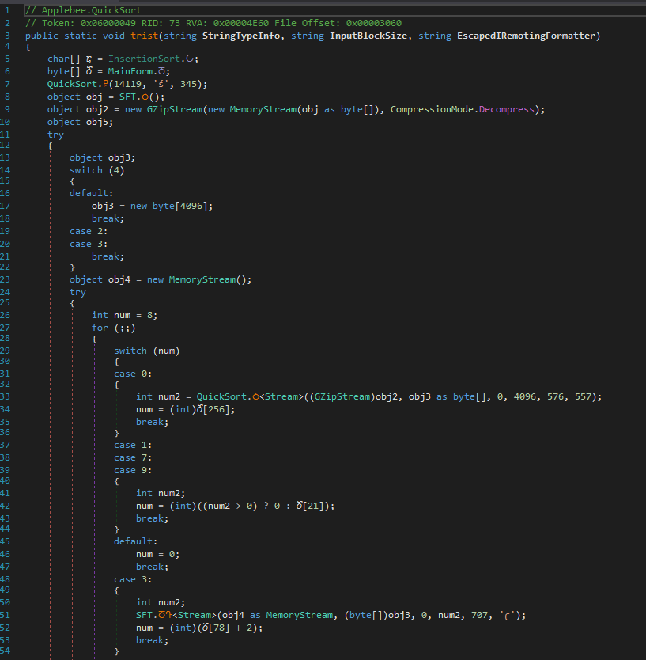
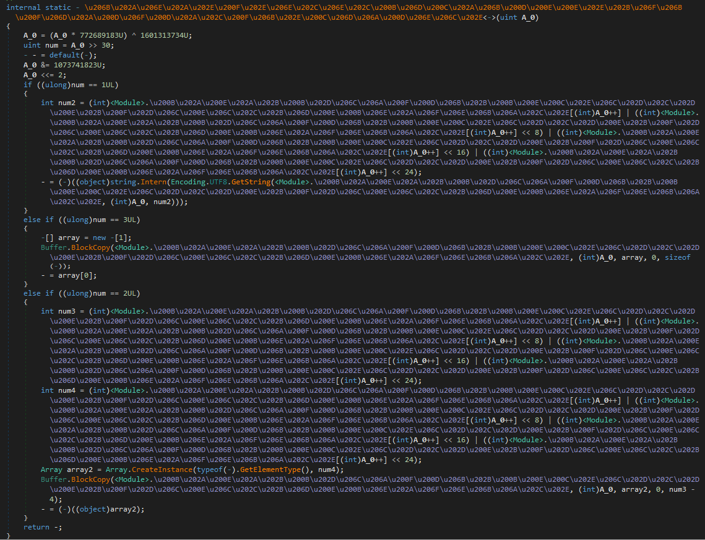

# Malware analysis NO. 1

## Input file

- Probable malware family: AgentTesla
- Filename: a27b90af0efe1643f641173c2a2efcb9eba21a9b4e2b13b8aa7513665fb490d7.exe
- Source: MalwareBazaar

## Analysis

### Analysis of the input file

Let's start by checking the input file in DetectItEasy, so we will know how to start us analysis.

|  |
|:--:|
| *DIE result for input file* |

We already know that the input file is a C# executable. There should be no packer or obfuscator, so our analysis should be easy and fun.
We will start our analysis by dropping the input file into dnSpy, to take a look inside the malware and then discover its functionalities.

|  |
|:--:|
| *Input file entry point* |

Nothing intresting in Main function, so let's dig deeper an move to frmMain function.

|  |
|:--:|
| *Malicious instructions in input file* |

Tracing the functions running from Main shows us a large chunk of data stored as a string and a malicious instructions used to decode and load a new module inside the current executable. Basically, the argument passed to *Assembly.Load* should be a byte array containing the contents of the new executable file, so putting a breakpoint after *frmMain.StringToByteArray* should allow us to dump the loaded file.

|  |
|:--:|
| *Invoked method in newly loaded executable* |

And voila, the first 2 bytes look like the next executable file (0x4D, 0x5A corresponds to MZ, which is the magic number of the DOS header)!
Now it would be great if we knew which function and with which arguments would be called from the newly loaded executable file. To get this, we need to place a breakpoint after the *MethodInfo* assignment.

By now, we know that the inovking function and arguments are *Applebee.QuickSort.trist("54717866", "7A7876", "QuanLyQuanAnNhanh")*. So let's dig deeper into the uploaded file!

### Analysis of the loaded file NO. 1

Let's move Loaded file into DIE to get some static info.

|  |
|:--:|
| *DIE result for Loaded file NO. 1* |

The same as the input file - a C# executable file and no packer or obfuscator was detected.

|  |
|:--:|
| *Loaded file NO. 1 invoked method* |

Looking into *Applebee.QuickSort.trist* we can spot control-flow-obfucation and name-obfuscation! So let's try detect used obfuscator by de4dot-cex.

```
command: de4dot.exe -d DroppedFile1.bin
output:  Detected DeepSea 4.1 (DroppedFile1.bin)
```

Knowing that the obfuscator used is of a known type, we will simply drag and drop the second stage of malware onto de4dot-cex.

|  |
|:--:|
| *Loaded file NO. 1 invoked method - deobfuscated* |

So we started to create a more structured code. We removed *Thread.Sleep* and renamed functions to improve readability. We may notice 2 times *Assembly.Load*, so we have to put a breakpoint before them to dump the loaded executable. In addition, it's a good idea to put a breakpoint after initializing the *MethodInfo* class to know what function will be called in stage #2. 

|  |
|:--:|
| *Loaded file NO. 1 invoked method - deobfuscated and cleaned* |

To simplify debugging the sample, let's change it from a dll file to an exe file, to do this we will write our own *Main* function, which will call the function originally ran by the input file with the appropriate arguments (*Applebee.QuickSort.trist("54717866", "7A7876", "QuanLyQuanAnNhanh")*)

|  |
|:--:|
| *Loaded file NO. 1 new Main()* |

|  |
|:--:|
| *Loaded file NO. 1 invoked method - deobfuscated and cleaned* |

Again, we can notice the DOS magic number *MZ*, so it may be a valid executable file, we will check it later.

|  |
|:--:|
| *Loaded file NO. 1, first loaded payload* |

During debugging, we noticed an exception because the resource sought by file #1 is not present. Note that by default, the file #1 is in the memory of the original process (from the input file), so we need to copy the searched resource to the currently debugged process. 

|  |
|:--:|
| *Loaded file NO. 1, first loaded payload* |

So let's put a breakpoint on the line where loaded file #1 tries to load a resource.

|  |
|:--:|
| *Loaded file NO. 1, first loaded payload* |

Ok, so the resource we are looking for is *"Tqxf "* from the entry *"QuanLyQuanAnNhanh.Properties.Resources "*! Let's drop this resource from the input file and attach it to the resource of the currently analyzed file. To do this, simply click on *Tqxf* and select "Save", then click on the resource in the dumped file NO. 1 and select "Create Multi File Resource ...", then "Create System.Data.Bitmap/Icon Resource" and type the same names as in the input file. Now, the analyzed file will work like charm.

|  |
|:--:|
| *Loaded file NO. 1, after copying the resource* |

During our debugging process we can spot usage of funcions from the second loaded file to modify data and then invoking funciotn from the third loaded file. So, we dumped both of the loaded file and placed breakpoint before method invoking, so we know that the invoking method in next stage will be *pUXkPSWO9XoDDxDeR7.uMi3doK0ax2sOgF8BM.dXN7qH3IKb()*!

|  |
|:--:|
| *Loaded file NO. 1, after copying the resource* |

|  |
|:--:|
| *Loaded file NO. 1, after copying the resource* |

### Analysis of the loaded file NO. 2

Like alwyas, let's start our analysis with placing file into DIE.

|  |
|:--:|
| *Loaded file NO. 2, DIE* |

DIE detected the use of the protector - *SmartAssembly*. Let's see what the called functions from the previous stage look like (*CausalitySource* and *SearchResult*). 

|  |
|:--:|
| *Loaded file NO. 2, invoked functions* |

Using the example of the *CausalitySource* method, we can see the obfuscation of the control flow. However, knowing that a known obfuscator was used, we can try de4dot for deobfuscation. Let's just drag on drop our obfuscated file onto de4dot.

|  |
|:--:|
| *Loaded file NO. 2, first called method in original state* |

After deobfuscation, we can analyze the loaded file NO. 2 in a simple way. We confirmed that this executable file is only used to modify the transferred data.

|  |
|:--:|
| *Loaded file NO. 2, first called method in deobfuscated state* |

|  |
|:--:|
| *Loaded file NO. 2, method used in first called method* |

|  |
|:--:|
| *Loaded file NO. 2, second called method in deobfuscated state* |

So let's move on to the next loaded file, NO. 3!

### Analysis of the loaded file NO. 3

Again, let's check what DIE detected.

|  |
|:--:|
| *Loaded file NO. 3, DIE* |

The DIE did not detect any obfuscator/packer/protector, so let's manually check if the file is armoured. We will check this by looking at the first called method - *pUXkPSWO9XoDDxDeR7.uMi3doK0ax2sOgF8BM.dXN7qH3IKb()*.

|  |
|:--:|
| *Loaded file NO. 3, entry* |

So we can see string encryption, proxy calls and a bit of control-flow and name obfuscation. 

|  |
|:--:|
| *Loaded file NO. 3, proxy calls example* |

|  |
|:--:|
| *Loaded file NO. 3, string resolving method* |

Let's start with de4dot to see what we can get.

```
command: de4dot.exe -d DroppedFile3.bin
output:  Detected Unknown Obfuscator
```

Okay, so let's just drag & drop, it always help.

|  |
|:--:|
| *Loaded file NO. 3, entry after de4dot* |

De4dot only helped us with the obfuscation of names, it changed the non-printable names to "method_%u". Let's try if we can decrypt strings using the token of one of the sample string decryption functions.

```
command: de4dot.exe DroppedFile3.bin  --strtok 6000004 --strtyp emulate
output:  Errors
```

```
command: de4dot.exe DroppedFile3.bin  --strtok 6000004 --strtyp delegate
output:  Errors
```

```
command: de4dot.exe DroppedFile3.bin  --strtok 6000004 --strtyp static
output:  No effects
```

By now, we will abandon string obfuscation. Now we will try NETReactorSlayer with custom deobfuscation options.

|  |
|:--:|
| *Loaded file NO. 3, NETReactorSlayer options* |

Nice, NETReactorSlayer helped us with proxy calls and simplified control-flow!

|  |
|:--:|
| *Loaded file NO. 3, entry after NETReactorSlayer* |

I have not found any tool that automatically decrypts strings in our case, so we need to analyze how it decrypts them. We can spot that *method_1* from *Module* is called, wchich intialize array of bytes, and then six methods (*method_2*, *method_5*, *method_4*, *method_5*, *method_6* from *Module*) are used to decrypt used offset to create string. So let's place a breakpoint on the initialized array, dump it, and then write a script that inserts strings in place of decryption functions. To do this, we will change our file type from dll to console and set the entry point to *pUXkPSWO9XoDDxDeR7.uMi3doK0ax2sOgF8BM.dXN7qH3IKb()*.

|  |
|:--:|
| *Loaded file NO. 3, modified to exe* |

|  |
|:--:|
| *Loaded file NO. 3, initialzed array with strings* |

Now we can confirm that the dropped array contains strings that will need to be placed instead of calling the decryption method.

|  |
|:--:|
| *Loaded file NO. 3, file with dumped strings array* |

So we see a pattern where 2 IL codes are used in decryption, *ldc.i4* as an argument and *call* to the decryption method.Assuming we will be rewriting/calling the decryption methods, we can modify them to change *ldc.i4* with a number to *ldstr* with a decrypted string, change *call* to *nop* and insert 4 *nop* to not mess up the control flow.

|  |
|:--:|
| *Loaded file NO. 3, decryption pattern - smethod_5 and smethod_6* |

The methods for decrypting strings look similar, so we'll rewrite them and call them through Python to finally modify the input file. Let's write a script that will do the magic for us.

```python
from sys import exit, argv
from os import path
from clr import AddReference
from struct import unpack

from CommonHelper import CommonHelper

dnlib_dll_path = path.join(path.dirname(__file__), "dnlib")
AddReference(dnlib_dll_path)
from dnlib.DotNet.Emit import OpCodes, Instruction
from System.Reflection import MethodInfo


class StringDecryptor:

    def __init__(self, static_string_arrr: bytearray) -> None:
        decrypt_string, decrypt_char, decrypt_smt = self.__decrypt_string, self.__decrypt_char, self.__decrypt_smt
        common_string_decrypt = self.__common_string_decrypt
        m_2 = lambda x: common_string_decrypt(x, 835887583,  4142697291, {0: decrypt_string, 2: decrypt_char, 3: decrypt_smt})
        m_3 = lambda x: common_string_decrypt(x, 772828559,  42226050,   {1: decrypt_string, 3: decrypt_char, 2: decrypt_smt})
        m_4 = lambda x: common_string_decrypt(x, 772689183,  1601313734, {1: decrypt_string, 3: decrypt_char, 2: decrypt_smt})
        m_5 = lambda x: common_string_decrypt(x, 3765275755, 3995412198, {2: decrypt_string, 1: decrypt_char, 3: decrypt_smt})
        m_6 = lambda x: common_string_decrypt(x, 2984458215, 1669748591, {0: decrypt_string, 1: decrypt_char, 2: decrypt_smt})
        self.m_dispatcher = (m_2, m_3, m_4, m_5, m_6)
        self.static_string_arrr = static_string_arrr

    def __decrypt_char(self, offset: int) -> str:
        return self.static_string_arrr[offset].decode()

    def __decrypt_string(self, offset: int) -> str:
        str_len = unpack("<I", self.static_string_arrr[offset: offset + 4])[0]
        return self.static_string_arrr[offset + 4: offset + 4 + str_len].decode()

    def __decrypt_smt(self, offset: int) -> Exception:
        raise Exception("Unused invoked!")

    def __common_string_decrypt(self, x: int, mul_val: int, xor_val: int, ops_dict: dict) -> str:
        x = ((x * mul_val) ^ xor_val) & 0xFFFFFFFF
        num = x >> 30
        x = (x & 1073741823) << 2

        return ops_dict[num](x) if num in ops_dict else "err!"

    def decrypt(self, method_idx: int, method_arg: int) -> str:
        return self.m_dispatcher[method_idx](method_arg)


class LoadedFile3Helper(CommonHelper):

    def __init__(self, input_file_path: str, input_file_static_strings: str) -> None:
        if not path.exists(input_file_static_strings):
            exit("[-] Static strings file not found")

        if not path.isabs(input_file_static_strings):
            input_file_static_strings = path.abspath(input_file_static_strings)

        with open(input_file_static_strings, "rb") as tmp_file:
            static_string_arrr = tmp_file.read()
            self.static_string_decryptor = StringDecryptor(static_string_arrr)

        super().__init__(input_file_path)

    def __patch_call_in_arg_place(self, method: MethodInfo, insnIdx: int, f_no: int) -> None:
        arg_call = int(method.Body.Instructions[insnIdx - 1].Operand)
        decrypted_str = self.static_string_decryptor.decrypt(f_no, arg_call)

        method.Body.Instructions[insnIdx - 1].OpCode = OpCodes.Ldstr
        method.Body.Instructions[insnIdx - 1].Operand = decrypted_str

        start_nop_offset = method.Body.Instructions[insnIdx - 1].Offset + method.Body.Instructions[insnIdx - 1].GetSize()
        replaced_insn_size = method.Body.Instructions[insnIdx].GetSize()

        for tmpInsnIdx in range(replaced_insn_size - 1):
            method.Body.Instructions.Insert(insnIdx + tmpInsnIdx, OpCodes.Nop.ToInstruction())

        for tmpInsnIdx in range(replaced_insn_size):
            method.Body.Instructions[insnIdx + tmpInsnIdx].OpCode = OpCodes.Nop 
            method.Body.Instructions[insnIdx + tmpInsnIdx].Operand = None 
            method.Body.Instructions[insnIdx + tmpInsnIdx].Offset = start_nop_offset + tmpInsnIdx

    def __force_patch_call_in_arg_place(self, method: MethodInfo) -> None:
        patched_insn = 0
        while True:
            method_repaired = True
            for insnIdx, insn in enumerate(method.Body.Instructions):
                looked_call, f_no = self.__filter_call_method(insn)
                if looked_call:
                    method_repaired = False
                    break

            if method_repaired:
                return patched_insn
                
            patched_insn += 1
            self.__patch_call_in_arg_place(method, insnIdx, f_no)

    def __filter_call_method(self, insn: Instruction) -> tuple[bool, int|None]:
        if insn.OpCode != OpCodes.Call or '<Module>::smethod_' not in str(insn.Operand):
            return False, None

        f_no = int(str(insn.Operand).split('_')[1][0]) - 2
        if f_no < 0:
            return False, None

        return True, f_no 

    def __patch_all_occurences_of_encrypted_strings(self) -> None:
        return sum(map(self.__force_patch_call_in_arg_place, self._get_filtered_methods()))

    def deobfuscate_file(self, *args: list) -> bool:
        return self.__patch_all_occurences_of_encrypted_strings() > 0
       

if __name__ == "__main__":
    if len(argv) != 3:
        exit(f"[!] Usage: {argv[0]} <dotnet_file_path> <extracted_static_strings_path>")

    loaded_file_3_helper = LoadedFile3Helper(*argv[1:])
    loaded_file_3_helper.parse_input_file()
```

Now we have a much better file to analyze its functionality, let's dig in!

|  |
|:--:|
| *Loaded file NO. 3, entry after custom string deobfuscator* |

After some renaming, we can see the full path of the malware's execution.

|  |
|:--:|
| *Loaded file NO. 3, entry after full deobfuscation* |

In the beginning, the malware may try to obtain a mutex to avoid reinfecting the victim. 

|  |
|:--:|
| *Loaded file NO. 3, attempt to obtain a mutex* |

In the next step, malware can sleep longer to bypass sandboxes that have a detection time limit. 

|  |
|:--:|
| *Loaded file NO. 3, sleep time* |

Then, the malware can display a pop-up window with custom text and a signature - this can be used to hide the malware's true intentions. For example, this Pop-Up window may display the message "You cannot run this application on your system!

|  |
|:--:|
| *Loaded file NO. 3, showing MessageBox* |

The malware can then bypass Windows Defender if it is run elevated. To achieve this, the malware executes the *Add-MpPreference -ExclusionPath* command, which disables the malware's scan for its own file.

|  |
|:--:|
| *Loaded file NO. 3, evading Windows Defender* |

In the next step, the malware can gain longevity by creating a scheduling task that run a copy of the malware when an user logs in.

|  |
|:--:|
| *Loaded file NO. 3, obtaining persistence* |

|  |
|:--:|
| *Loaded file NO. 3, creating schedule task* |

```xml
<?xml version="1.0" encoding="UTF-16"?>
<Task version="1.2" xmlns="http://schemas.microsoft.com/windows/2004/02/mit/task">
  <RegistrationInfo>
    <Date>2014-10-25T14:27:44.8929027</Date>
    <Author>[USERID]</Author>
  </RegistrationInfo>
  <Triggers>
    <LogonTrigger>
      <Enabled>true</Enabled>
      <UserId>[USERID]</UserId>
    </LogonTrigger>
    <RegistrationTrigger>
      <Enabled>false</Enabled>
    </RegistrationTrigger>
  </Triggers>
  <Principals>
    <Principal id="Author">
      <UserId>[USERID]</UserId>
      <LogonType>InteractiveToken</LogonType>
      <RunLevel>LeastPrivilege</RunLevel>
    </Principal>
  </Principals>
  <Settings>
    <MultipleInstancesPolicy>StopExisting</MultipleInstancesPolicy>
    <DisallowStartIfOnBatteries>false</DisallowStartIfOnBatteries>
    <StopIfGoingOnBatteries>true</StopIfGoingOnBatteries>
    <AllowHardTerminate>false</AllowHardTerminate>
    <StartWhenAvailable>true</StartWhenAvailable>
    <RunOnlyIfNetworkAvailable>false</RunOnlyIfNetworkAvailable>
    <IdleSettings>
      <StopOnIdleEnd>true</StopOnIdleEnd>
      <RestartOnIdle>false</RestartOnIdle>
    </IdleSettings>
    <AllowStartOnDemand>true</AllowStartOnDemand>
    <Enabled>true</Enabled>
    <Hidden>false</Hidden>
    <RunOnlyIfIdle>false</RunOnlyIfIdle>
    <WakeToRun>false</WakeToRun>
    <ExecutionTimeLimit>PT0S</ExecutionTimeLimit>
    <Priority>7</Priority>
  </Settings>
  <Actions Context="Author">
    <Exec>
      <Command>[LOCATION]</Command>
    </Exec>
  </Actions>
</Task>
```

The last action taken by the malware is to decrypt the resource and run it through its own memory or inject it into another process.

|  |
|:--:|
| *Loaded file NO. 3, running next malware stage* |

So knowing that it's still not AgentTesla, let's dump the payload and dig deeper into it. To dump the payload we'll skip the execution path to *Helper.DecryptData(Helper.GetResource(uMi3doK0ax2sOgF8BM.ResourceName), uMi3doK0ax2sOgF8BM.DecryptionKey);* and place a breakpoint after this call.

|  |
|:--:|
| *Loaded file NO. 3, dumping next malware stage* |

Again, we can detect the magic bytes *MZ*, so let's dump this file from memory and continue the analysis!

### Analysis of the loaded file NO. 4

We will put the dumped file in DIE to see if it contains obfuscators/packers/protectors.

|  |
|:--:|
| *Loaded file NO. 4, DIE* |

Nothing was detected, so let's see how the entry point looks like in dnSpy.

|  |
|:--:|
| *Loaded file NO. 4, obfuscated entry point* |

Okay, so we can spot a control-flow obfuscation, similar to the obfuscation spotted in previous samples. Let's try detecting the obfuscator via de4dot.

```
command: de4dot.exe -d DroppedFile4.bin
output:  Detected Unknown Obfuscator
```

None of deobfuscator I know has helped me deobfuscate this control-flow obfuscation, so let's try to find a pattern and then write our own deobfuscator.

|  |
|:--:|
| *Loaded file NO. 4, patterns for start and common chunk obfuscation* |

|  |
|:--:|
| *Loaded file NO. 4, patterns for end and common chunk obfuscation* |

So we can see 4 patterns used to control the flow of the program.
Obfuscation entry:
- Ldc_I4 - initial value (always 0).
- Stloc - variable that is used to control the flow.
- Br - jump to the obfuscation loop entry.

Obfuscation exit:
- Br - jump to return from method.
- Br - jump to the obfuscation loop entry.

Code block entry:
- Nop - unused NOP, always at the beginning.
- Ldloc - loads the value of the variable used to control the flow.
- Ldc_I4 - contains the expected value of the variable used to control the flow.
- Ceq - compares the expected value with the variable used to control the flow.
- Brfalse - performs a conditional jump, depends on ceq.

Code block exit:
- Ldc_I4 - new value for the variable used for flow control.
- Stloc - storing the new value in the variable used to control the flow.

|  |
|:--:|
| *Loaded file NO. 4, control flow deobfuscation flow* |

Knowing how the obfuscation is performed, we can write a script that removes the obfuscation from the analyzed file.

```python
from sys import exit, argv
from clr import AddReference
from os import path
from CommonHelper import CommonHelper

dnlib_dll_path = path.join(path.dirname(__file__), "dnlib")
AddReference(dnlib_dll_path)
from dnlib.DotNet.Emit import OpCodes, Instruction
from System.Reflection import MethodInfo


class UnCFF:
	PATTERN_START, PATTERN_START_LEN = (OpCodes.Ldc_I4, OpCodes.Stloc, OpCodes.Br), 3
	COMMON_CHUNK, COMMON_CHUNK_LEN = (OpCodes.Nop, OpCodes.Ldloc, OpCodes.Ldc_I4, OpCodes.Ceq, OpCodes.Brfalse), 5
	PATTERN_BODY, PATTERN_BODY_LEN = (OpCodes.Ldc_I4, OpCodes.Stloc), 2
	PATTERN_END, PATTERN_END_LEN = (OpCodes.Br, OpCodes.Br), 2

	def __try_get_pattern(self, method: MethodInfo, max_insn: int, skip_count: int, pattern: tuple, pattern_len: int, extra_arg=lambda _:True) -> tuple[bool, int|None]:
		for idx, insn in enumerate(method.Body.Instructions, start=skip_count):
			if idx + pattern_len > max_insn:
				return False, None

			tmp_ops = tuple(map(lambda x: method.Body.Instructions[idx + x].OpCode, range(pattern_len)))
			if tmp_ops == pattern and extra_arg(idx):
				return True, idx

		return False, None

	def __try_found_start(self, method: MethodInfo, max_insn: int) -> tuple[bool, int|None, str|None]:
		found_pattern, idx = self.__try_get_pattern(method, max_insn, 0, self.PATTERN_START, self.PATTERN_START_LEN)
		if found_pattern:
			dispatcher_variable = method.Body.Instructions[idx + 1].Operand
			return True, idx, dispatcher_variable

		return False, None, None

	def __try_get_rest(self, method: MethodInfo, max_insn: int, skip_count: int, dispatcher_variable: str) -> list|None:
		skip_count += self.PATTERN_START_LEN
		chunks = {}
		found_end_pattern = False
		points_to_dispatcher = lambda idx: method.Body.Instructions[idx + 1].Operand == dispatcher_variable
		copy_instructions = lambda start_idx, end_idx: tuple(map(lambda idx: method.Body.Instructions[idx], range(start_idx, end_idx)))
		flat_map = lambda f, xs: [y for ys in xs for y in f(ys)]

		while skip_count < max_insn:
			found_pattern, idx = self.__try_get_pattern(method, max_insn, skip_count, self.COMMON_CHUNK, self.COMMON_CHUNK_LEN, points_to_dispatcher)
			if not found_pattern:
				continue

			skip_count = idx + self.COMMON_CHUNK_LEN
			chunk_no = method.Body.Instructions[idx + 2].Operand
			found_pattern, idx = self.__try_get_pattern(method, max_insn, skip_count, self.PATTERN_BODY, self.PATTERN_BODY_LEN, points_to_dispatcher)
			if not found_pattern:
				found_end_pattern, idx = self.__try_get_pattern(method, max_insn, skip_count, self.PATTERN_END, self.PATTERN_END_LEN)
				idx += self.PATTERN_END_LEN
				break

			founed_chunk = copy_instructions(skip_count, idx)
			skip_count = idx + self.PATTERN_BODY_LEN
			chunks |= {chunk_no: founed_chunk}

		if not found_end_pattern:
			return None

		tail = {len(chunks): copy_instructions(idx, max_insn)}
		chunks |= tail
		chunks = flat_map(lambda x: x, dict(sorted(chunks.items())).values())
		return chunks

	def __tokenize(self, method: MethodInfo) -> list|None:
		max_insn = len(method.Body.Instructions)
		
		found_start, start_idx, dispatcher_variable = self.__try_found_start(method, max_insn)
		if not found_start:
			print(f"[-] UnCFF didn't found obfuscation for {method.Name}")
			return None

		body = self.__try_get_rest(method, max_insn, start_idx, dispatcher_variable)
		if not body:
			print(f"[-] UnCFF fail for {method.Name}")
			return None

		if start_idx > 0:
			head = list(map(lambda x: method.Body.Instructions[x], range(start_idx)))
			body = head + body

		new_insn_len = len(body)
		if new_insn_len < max_insn:
			body = body + list(map(lambda x: OpCodes.Nop.ToInstruction(), range(max_insn - new_insn_len)))

		return body

	def update_method(self, method: MethodInfo) -> int:
		instructions = self.__tokenize(method)
		max_insn = len(method.Body.Instructions)

		if not instructions or len(instructions) == 0:
			return 0

		offset = 0
		for idx, insn in enumerate(instructions):
			method.Body.Instructions[idx] = instructions[idx]
			method.Body.Instructions[idx].Offset = offset
			offset += method.Body.Instructions[idx].GetSize()

		return len(instructions)


class LoadedFile4Helper(CommonHelper):

	def __repair_control_flow(self) -> None:
		un_cff = UnCFF()
		return sum(map(un_cff.update_method, self._get_filtered_methods()))

	def deobfuscate_file(self, *args: list) -> bool:
		return self.__repair_control_flow() > 0


if __name__ == "__main__":
    if len(argv) != 2:
        exit(f"[!] Usage: {argv[0]} <dotnet_file_path>")

    loaded_file_4_helper = LoadedFile4Helper(*argv[1:])
    loaded_file_4_helper.parse_input_file()
```

After running the deobfuscation script, we got a much better file for analysis, so let's get started!

|  |
|:--:|
| *Loaded file NO. 4, deobfuscation control flow* |

It is somewhat surprising that in malware there are correctly named variables.

|  |
|:--:|
| *Loaded file NO. 4, correct, original variable names* |

So let's enter the main method of the malware (previous named as yTSIt3JDF) and set the properly method names that will help us in further analysis. So it looks like a very easy sample. The malware initially iterates and kills other instances of its own. Then it initializes some data, such as the victim's IP address. Next, the malware tries to collect sensitive data from the from selected applications. In the next step, the malware launches a mechanism to cyclically collect information about keys pressed, clipboard contents and take screenshots. Finally, malware send all gathered data to adversary.

|  |
|:--:|
| *Loaded file NO. 4, main malware method* |

Killing other malware instances is simple, it iterates through processes on the system with the same name as its own and kills instances with a different PID.

|  |
|:--:|
| *Loaded file NO. 4, killing other instances* |

So, during malware initialization the most valuable thing is to get the victim's IP address, this is done by sending an http request to *hxxps[://]api[.]ipify[.]org*.

|  |
|:--:|
| *Loaded file NO. 4, preparing malware* |

|  |
|:--:|
| *Loaded file NO. 4, obtaining the victim's IP address through an external site* |

The malware then generates a list with the results of the collected data from the selected applications, and then sends the gathered data to the adversary's server.

|  |
|:--:|
| *Loaded file NO. 4, user data exfiltration* |

|  |
|:--:|
| *Loaded file NO. 4, applications selected to steal data from them* |

|  |
|:--:|
| *Loaded file NO. 4, user data collected* |

List of exfiltrated user data:
- User name,
- Computer name,
- Operating system name,
- Processor name,
- Ram size,
- Windows credentials,
- IP address.

List of all applications from which the sample tries to obtain sensitive data:
- IE/Edge,
- UC Browser,
- Safari for Windows,
- QQ Browser,
- Falkon Browser,
- Flock Browser,
- Outlook,
- Windows Mail App,
- TheBat!,
- Becky!,
- IncrediMail,
- Eudora,
- ClawsMail,
- FoxMail,
- Opera Mail,
- PocoMail,
- eM Client,
- Mailbird,
- FileZilla,
- WinSCP,
- CoreFTP,
- Flash FXP,
- FTP Navigator,
- SmartFTP,
- WS_FTP,
- FtpCommander,
- FTPGetter,
- OpenVPN,
- NordVPN,
- Private Internet Access,
- RealVNC/TightVNC/UltraVNC,
- Discord,
- Trillian,
- Psi/Psi+,
- MysqlWorkbench,
- Internet Downloader Manager,
- JDownloader 2.0,
- Opera Browser,
- Yandex Browser,
- Iridium Browser,
- Chromium,
- 7Star,
- Torch Browser,
- Cool Novo,
- Kometa,
- Amigo,
- Brave,
- CentBrowser,
- Chedot,
- Orbitum,
- Sputnik,
- Comodo Dragon,
- Vivaldi,
- Citrio,
- 360 Browser,
- Uran,
- Liebao Browser,
- Elements Browser,
- Epic Privacy,
- Coccoc,
- Sleipnir 6,
- QIP Surf,
- Coowon,
- Chrome,
- Edge Chromium,
- Firefox,
- SeaMonkey,
- Thunderbird,
- BlackHawk,
- CyberFox,
- K-Meleon,
- IceCat,
- PaleMoon,
- IceDragon,
- WaterFox,
- Postbox,
- Flock.

The malware can then run spyware functions - collecting data from the keyboard, clipboard and screen and sending it to the adversary every interval selected in the configuration.

|  |
|:--:|
| *Loaded file NO. 4, keylogger and clipboard data graber* |

|  |
|:--:|
| *Loaded file NO. 4, screen graber* |

So this is the last form of input file, after 4 loaded files we can say that's it. Now we can confirm that the adversary used intermediate forms to hide the target malware sample, which was AgentTesla!

## Summary

### Input file

#### Info

Type: Loader

Family: Unknown

Capabilities: 
- In-memory executing of the next stage of malware from the resource.

#### File

| HASH   | VALUE															|
|--------|------------------------------------------------------------------|
| MD5    | 281c7c1788f801756ff43accf62eb141								  	|
| SHA1   | 93c88a775010dc5f88bbcb2bdc334db894a59f25						  	|
| SHA256 | a27b90af0efe1643f641173c2a2efcb9eba21a9b4e2b13b8aa7513665fb490d7 |

### Loaded file NO. 1

#### Info

Type: Loader

Family: Unknown

Capabilities: 
- In-memory executing of the next stage of malware from the resource,
- Delaying startup.

#### File

| HASH   | VALUE															|
|--------|------------------------------------------------------------------|
| MD5    | 7a2a4ddd1bf10938d6f04b895d96dca4								  	|
| SHA1   | 989e628fb907dbee96cd186396ee9e6ea7d077d4						  	|
| SHA256 | 1680e7754136727972cb14bacab15725a728ecc5a1105b13779ef5e51ca99b8e |

### Loaded file NO. 2

#### Info

Type: None

Family: N/A

Capabilities: 
- Modifying data.

#### File

| HASH   | VALUE															|
|--------|------------------------------------------------------------------|
| MD5    | d57ba8cdc26064b4bb6d9a54d192eeb9								  	|
| SHA1   | 5667c386c978441a63c13a0bcad6a12b7532281c						  	|
| SHA256 | 1d33d555b73c704ff4fe4034d52b78ea5adc015480134730ee5be35dda903dba |

### Loaded file NO. 3

#### Info

Type: Loader

Family: Unknown

Capabilities: 
- In-memory executing of the next stage of malware from the resource,
- Downloading and running the next stage of malware,
- Obtaining persistence,
- Bypassing Windows Defender,
- Injecting into another process,
- Delaying startup.

#### File

| HASH   | VALUE															|
|--------|------------------------------------------------------------------|
| MD5    | 9305b273f02be15e706551ffece7fd28								  	|
| SHA1   | e27eb244c3d894de1d743b291a9c17a7a0d4447f						  	|
| SHA256 | 8b52645347a5aa909e8c9f479d13d87bdd7bd68ead34d4ac581138d5c13c2c00 |

#### IOC

| TYPE       	  | VALUE				|
|-----------------|---------------------|
| Mutex name 	  | RpqyIyibBNxmVDLcNOB	|
| Copied filename | uivHgNvF			|
| Schtasks name   | Updates				|

### Loaded file NO. 4

#### Info

Type: Stealer

Family: AgentTesla

Capabilities:
- User data exfiltration,
- Credentials theft,
- Spying on user input,
- Screen capturing.

#### File

| HASH   | VALUE															|
|--------|------------------------------------------------------------------|
| MD5    | 391bc07d1ab4574ca9c059a3449520d7								  	|
| SHA1   | 099cdb19b8a63f041984ec203dd86d8f23d0f3d6						  	|
| SHA256 | 9f81a11001ec047da1df2d2809ea58d833854ee0e5a1d680b34cc739b7e9488f |

#### IOC

| TYPE       	| VALUE																			 |
|---------------|--------------------------------------------------------------------------------|
| User-agent    | Mozilla/5.0 (Windows NT 10.0; Win64; x64; rv:99.0) Gecko/20100101 Firefox/99.0 |
| Helper URL    | hxxps[://]api[.]ipify[.]org 													 |
| SMTP server 	| mail[.]umutdiyalizmerkezi[.]com 												 |
| SMTP sender 	| guner[@]umutdiyalizmerkezi[.]com 												 |
| SMTP receiver | Shem[.]Fujiw[@]gmx[.]com 														 |
