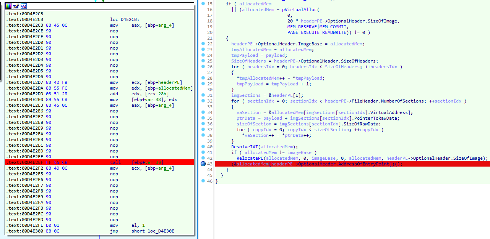
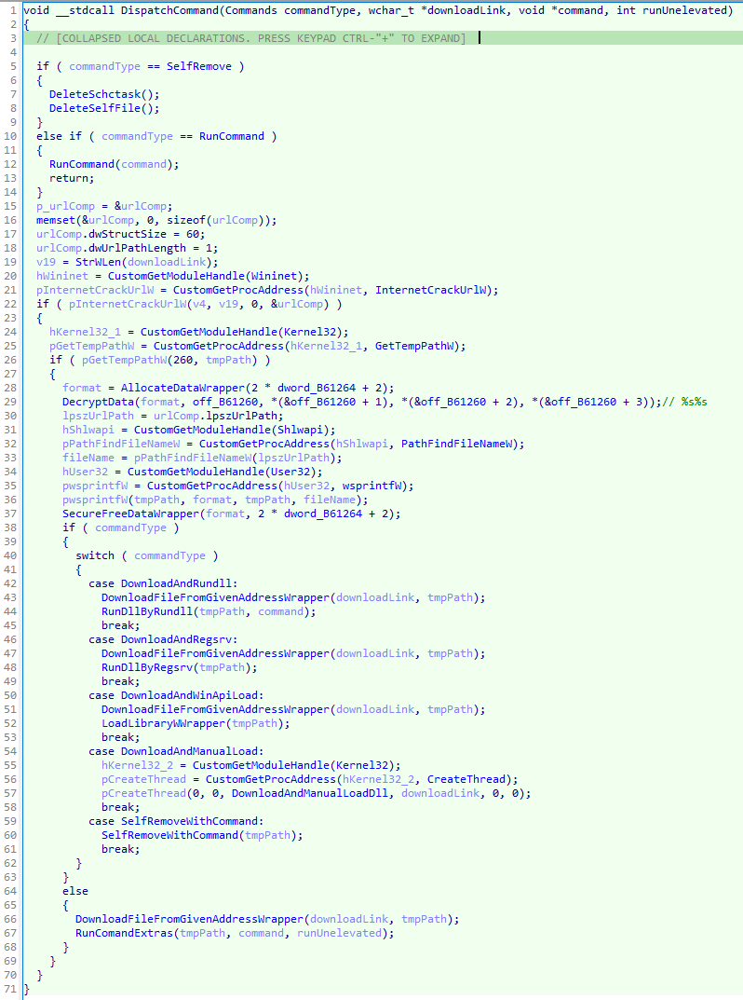

# Malware analysis NO. 2

## Input file

- Probable malware family: Colibri Loader
- Filename: 030340b93655a258d69c01e334877bb36a49a5fafd23927216020b99a3e3c738.bin
- Source: MalwareBazaar

## Analysis

### Analysis of the input file

Let's start by checking the input file in DetectItEasy, so we will know how to start us analysis.

|  |
|:--:|
| *DIE result for input file* |

Okay, so it's a executable file, without packers and protectors. So let's take a look at this file in IDA.

|  |
|:--:|
| *Malware main func* |

So the main function of the malware looks a bit odd. To speed up the analysis, we will use *CAPA* from *Mandiant* to find something interesting. 

|  |
|:--:|
| *CAPA result* |

CAPA has detected malicious activity that can lead to dynamic address resolution of WinAPI functions. Let's check it out and try to understand what's going on there.

|  |
|:--:|
| *Obfuscated decompiled code* |

In the decompile view, we can see the obfuscated code that points to *PEB* and maybe iterates over *InMemoryOrderModuleList*, then uses part of its structure for calculations and compares the result with a known value. This is a good point to go higher and see how the program flow is constructed.

|  |
|:--:|
| *Malicious code chunk* |

Going above the first of the checked function shows 4 functions that are called before *ExitProcess*, so let's examine them:

|  |
|:--:|
| *First function from malicious chunk* |

- *sub_42D960* is a wrapper for *SetLayeredWindowAttributes* (nothing malicious at first sight).

|  |
|:--:|
| *Second function from malicious chunk* |

- *sub_42D120* is the first function we looked at, which can perhaps resolve WinAPI function addresses (the use of *Ldr->InMemoryOrderModuleList* is often used to dynamically resolve WinAPI function addresses).

|  |
|:--:|
| *Third function from malicious chunk* |

|  |
|:--:|
| *Suspicious data blob* |

- *sub_42DCE0* is a function that takes action with a large blob of data - perhaps next stage decryption/decoding (*aLqdtuqgupesugt* points to a large block of data and is modified in further function code.).

|  |
|:--:|
| *Fourth function from malicious chunk* |

- *sub_42DF20* probably takes action using the resolved api cals from *sub_42D960* (*dword_433580* may contain the address to an unknown WinAPI function).

So we already know that we need to do some cleaning up in the assembly to get better decompiled code. Let's start with deobfuscation!

|  |
|:--:|
| *Obfuscation example* |

The obfuscation method is numerous calls to the redundant *sub_42C820* and *sub_42DF00* functions, which increase the size of the obfuscated function. So let's analyze how it looks like in assembly! 

|  |
|:--:|
| *Example of a redundant function call* |

So we can notice a pattern that looks:

```assembly
    push    <various>  	; unused arg - size = various
    call    sub_42C820 	; call to function 0 - size = 5
    add     esp, 4 	; clean up stack - size = 2
```

Knowing this, we can write a script that removes unnecessary function calls by patching them with nop's.

```python
import idc
import idautils
import ida_idp

def find_calls_to_patch(target_functions):
    flat_map = lambda f, xs: [y for ys in xs for y in f(ys)]
    
    filtered_functions = filter(lambda x: idc.get_name(x) not in target_functions, idautils.Functions())
    functions_addr = flat_map(Chunks, filtered_functions)
    heads = flat_map(lambda x: Heads(*x), functions_addr)
    get_valid_calls = lambda x: ida_idp.is_call_insn(x) and idc.get_operand_value(x, 0) in target_functions
    calls = filter(get_valid_calls, heads)
    return calls

def patch_calls(target_addresses):
    call_and_add_size = 0x5 + 0x3
    for patch_addr in target_addresses:
        patch_addr = prev_head(patch_addr)
        prev_insn_size = idautils.DecodeInstruction(patch_addr).size
      
        patch_size = call_and_add_size + prev_insn_size
        nops = b"\x90" * patch_size
        ida_bytes.patch_bytes(patch_addr, nops)
        print(f"Patching at {patch_addr} ...done")

    print(f"Fixed all redundant functions")


if __name__ == "__main__":
    targets_ea = (idc.get_name_ea_simple("sub_42DF00"), idc.get_name_ea_simple("sub_42C820"))
    taregt_calls = find_calls_to_patch(targets_ea)
    patch_calls(taregt_calls)
```

After executing the script, we got a much better code for analysis! Let's go to the decompilation view to make surte about that.

|  |
|:--:|
| *Example of deobfuscated code snippet* |

So, after proper deobfuscation, we can start describing malicious functions:
- *sub_42D960* has been abandoned due to the fact that it does not execute significant code for malware.

|  |
|:--:|
| *Api resolving func* |

- *sub_42D120* has been renamed to *ApiResolve* because it implements api resolving. It uses the ROT13 algorithm to generate function name abbreviations and compare the results with known values. I used *https://github.com/ihack4falafel/ROR13HashGenerator/blob/master/pre_computed_hashes/kernel32.md* to get WinAPI function names. The api set searched for is *LoadLibraryA*, *GetProcAddress*, *VirtualAlloc* and *VirtualFree* from *Kernel32.dll*.

|  |
|:--:|
| *Allocation and decoding of the payload* |

- *sub_42DCE0* has been renamed to *AllocAndDecodePayload* because it only allocates enough memory for the next stage and then decodes it.

|  |
|:--:|
| *Reflective loading dll* |

- *sub_42DF20* has been renamed to *ReflectiveLoadCode* because there are a classic implemenation of this technique (example: *https://www.ired.team/offensive-security/code-injection-process-injection/reflective-dll-injection* ).

So, after renaming, we got the described malicoius code fragment, which looks as follows.

|  |
|:--:|
| *Malicious code chunk after renaming* |

We already know that there will be a next stage of malware and to dump it in the easiest way we need to place a breakpoint before calling the entry point of the next stage!

|  |
|:--:|
| *Location of breakpoint used to drop next stage* |

After running the program, we can easily notice the magic bytes *DOS_HEADER* in the allocated memory from the function *AllocAndDecodePayload*. To get the size of the allocated memory we just need to read the value of the *PayloadSize* variable. Having the above information, we can dump the next stage of malware.

|  |
|:--:|
| *Next stage in memmory* |

|  |
|:--:|
| *Size of the next stage executable file* |

So let's move on to the next form of malware!

### Analysis of the loaded file NO. 1

Like always, let's see the DIE output for our sample.

|  |
|:--:|
| *DIE result for next stage* |

Okay, it's shouldn't be an armored file so let's drop it into IDA.

|  |
|:--:|
| *Obfuscation spotted in malware* |

After the *start* label, we can see the branch opaque predicates obfuscation, the *jz* and *jnz* instructions jump to the same address.

|  |
|:--:|
| *Obfuscation patched in malware* |

So we simply undid the code definition in IDA at address *0x0040579E* and define as code from address *0040579F*.

|  |
|:--:|
| *Another case of obfuscation of branching instructions in malwaree* |

After noticing more instances of obfuscation, I decided to write a simple script that would patch all subsequent occurrences of this type of obfuscation, since there is the following pattern of obfuscation.

```assembly 
    JZ      X   ;jump if zero-flag is set
    JNZ     X   ;jump if zero-flag is not set
    0xB8        ;junk byte
X:
    ...         ;real code
```

```python
import idc
import idaapi

def nop_jump_predictions():
    search_bytes = "74 03 75 01 B8"  
    replace_bytes = b"\x90" * 5 
    ea_start = 0x4055A7
    ea_end = 0x00405C00
    ea = idaapi.find_binary(ea_start, ea_end, search_bytes, 16, idaapi.SEARCH_DOWN)
    while ea != idaapi.BADADDR:
        print(f"Patching at {hex(ea)} ...done")
        idaapi.patch_bytes(ea, replace_bytes)
        ea = idaapi.find_binary(ea + 1, ea_end, search_bytes, 16, idaapi.SEARCH_DOWN)

    print(f"Fixed all cases of jz/jnz obfuscation")

if __name__ == "__main__":
  nop_jump_predictions()
```

After running the script and setting the patched bytes as code, we can see the valid, deobfuscated function, so we can start our analysis!

|  |
|:--:|
| *Deobfuscated, first called function in malware* |

Let's look at the functions called from *sub_4057A8* (since the malware *main* only calls this function) and call it the real main function of the malware.

|  |
|:--:|
| *First look at the second function called* |

So in the *sub_4057A8* function, we can see initialization of data, saving pointers from *PEB->Ldr->InLoadOrderModuleList*, resolving addresses by *sub_401CE2* that are further called. Function *sub_401CE2* contains strings *"MZ"*, *"PE"*, and pattern that could be a custom implementation of *GetProcAddress*. So this could be a initialization of the WinAPI used and/or imported libraries. Let's analyze it.

|  |
|:--:|
| *Cleaned the second function called* |

|  |
|:--:|
| *Decompilation of custom GetProcAddress* |

After analysis of aforementioned functions, we can confrim that *sub_4057A8* loads nesseseary Dll's and *sub_401CE2* implements custom *GetProcAddress*. So we changed name of *sub_4057A8* to *LoadLibs* and *sub_401CE2* to *CustomGetProcAddress* (despite the not-so-best decompilation view). 

During reversing *CustomGetProcAddress*, I decided to obtain all the hashes with which it compares the Windows API names. To do this, I wrote 2 simple scripts that will print the values generated by the malware. After satisfying the *jz short loc_C51D62* condition, I changed the control flow to get the rest of the hashes.

|  |
|:--:|
| *Breakpoints to acquire generated Windows Api shortcuts* |

First bp, placed on call to *MakeHash* to print Windows Api name:

```python
def print_api_name():
    chr_pos = get_reg_value("ECX")
    bin_str = ""

    while True:
        api_chr = idaapi.get_byte(chr_pos)
        if not (0x21 < api_chr < 0x7F):
            break

        chr_pos += 1
        bin_str += chr(api_chr)
        
    print(bin_str, end=" -> ")

if __name__ == "__main__":
    print_api_name()
```

Second bp, placed after call to *MakeHash* to print Windows API hash:

```python 
def print_hash_result():
    print(hex(get_reg_value("EAX")))

if __name__ == "__main__":
    print_api_name()
```

And then I obtained tuples of Windows API and its hash for all imported dlls. A couple of examples for *Kernel32.dll*.

```
CreateEventW -> 0x1f196356
CreateFiber -> 0x2d3c6f48
CreateFiberEx -> 0x6caa3780
CreateFile2 -> 0xfa5796f7
CreateFileA -> 0x93a6ec56
CreateFileMappingA -> 0x37e3cd5
CreateFileMappingFromApp -> 0x6db93181
CreateFileMappingNumaA -> 0x729bf54d
```

We will use these hashes later, for now let's check another function - *sub_403783*. When analyzing *sub_403783*, we can notice *sub_405ABF*, which looks like a decryption routine. 

|  |
|:--:|
| *Third called function* |

|  |
|:--:|
| *Decryption routine* |

After cleaning *sub_403783* I found a script dedicated to decrypting strings in *Colibri Loader* ( *https://github.com/Casperinous/colibri_loader/blob/main/colibri_decrypt_str.py* ), which looks similar to the code in our malware, so I gave it a shot and it did a great job! 

|  |
|:--:|
| *Decryption routine reversed* |

At this point, I decided to describe the rest of the functions, because I have received information about the strings used and I know which and where the WindowsAPI function will be called!

|  |
|:--:|
| *Identification of the likely country of infection* |

So I renamed *sub_403783* to *PrepareMalware*, because this function compares the decrypted IPv4 address with the known hash of the result, and checks whether the starting country is in the (mostly) *Commonwealth of Independent States* (where the 106 comparison error may be generated by inaccuracy compared to Armenian / Azerbaijani, just a guess), on which the conditional neutralization of malware depends.

|  |
|:--:|
| *Procedure for identifying the presence of other malware instances* |

I then renamed *sub_403675* to *CheckMalwareMutexPresence*, because this function again compares the decrypted IPv4 address with the known hash of the result (which is odd) and checks if another malware instance held its mutex, if so, the malware exits.

|  |
|:--:|
| *Function responsible for establishing connection with C2 server* |

The malware tries to connect to the C2 server, where it can have up to 2 addresses in its configuration (or one, and then it makes 2 attempts to connect, as in the case under analysis). 

|  |
|:--:|
| *Implementation of connection establishment* |

|  |
|:--:|
| *Generation of victim ID* |

To establish a connection, it sends the following request: *188[.]130[.]139[.]47/gate[.]php?type=check&uid={victimID}*. Where the value *{victimID}* is generated on the host, by value from *GetVolumeInformationW*. It then waits for the response, which is decoded by the *BASE64* algorithm and then decrypted by the *RC4* algorithm with the encoded key and compares the result with string *"SUCCESS"*, which means a valid connection.

|  |
|:--:|
| *Checking the origin of the file from which the malware was launched* |

|  |
|:--:|
| *Activities that increase malware evasion on newer systems* |

|  |
|:--:|
| *Location of new file on older systems* |

|  |
|:--:|
| *The use of schtasks* |

If the connection is correct, the malware checks from which file it was launched. If it wasn't run from a specific location, it copies itself to the selected location, deletes its own file and runs it through a task: */create /tn COMSurrogate /st 00:00 /du 9999:59 /sc once /ri 1 /f /tr {Colibri Loader path}* . The *Colibri Loader* checks if it was run on a system newer or older than *Windows 10*. For older versions, it copies itself to *{SysetmDiskLetter}:\Users\{Username}\Documents\WindowsPowerShell\dllhost.exe*, and for newer versions it copies itself to *{SysetmDiskLetter}:\Users\{Username}\AppData\Local\Microsoft\WindowsApps\Get-Variable.exe* .

|  |
|:--:|
| *User data exfiltration, part 1* |

|  |
|:--:|
| *User data exfiltration, part 2* |

The malware then begins exfiltrating the user's data, which it first encrypts using RC4 cipher with the key contained in its own file and then encrypts with the BASE64 algorithm. Exfiltrated data is sent to *188[.]130[.]139[.]47/gate[.]php?type=update&uid={victimID}*. The decompilation view does not look the best, but we can infer from it that the following information is being sent: 
- Windows Product Key,
- Process bitness (32/64 bit),
- Computer name,
- User name,
- Privilege flag,
- Malware version.

|  |
|:--:|
| *Checking the request from the adversary, part 1* |

|  |
|:--:|
| *Checking the request from the adversary, part 2* |

Despite the not quite correct decompilation, we can see that the last function (which is not used to retrieve WinAPI) called from the real main function is used to request new commands from the C2 server. It sends the request to *188[.]130[.]139[.]47/gate[.]php?type=ping&uid={victimID}*, and then decodes its contents with the *BASE64* algorithm and decrypts it with *RC4*. The decrypted data is first compared with the *"NUPD "* string, and if there is a difference, it is parsed. The malware expects the data in the following form *"{CommandNumber}|{DownloadLink}|{Command/ExportedFuncName}|{ElevationFlag}"*. The "*NUPD*" command instructs the function responsible for escfiltration to execute, while the arguments extracted from the formatted string are passed to the function that handles them.

|  |
|:--:|
| *A function that checks the task downloaded from the C2 server* |

|  |
|:--:|
| *A wrapper function that downloads a file and removes metadata about the downloaded file* |

|  |
|:--:|
| *Function responsible for downloading files* |

Thus, the malware supports the following types of adversary commands:

|  |
|:--:|
| *Function that executes the adversary's command* |

0 - Downloading a file from the address sent by the adversary, and then executing its command with possible privilege elevation.

|  |
|:--:|
| *Function that runs the downloaded file using rundll32.exe* |

1 - Downloading a dll file from the address sent by the adversary, and then loading it via *rundll32*.

|  |
|:--:|
| *Function that runs the downloaded file using regsrv32.exe* |

2 - Downloading the dll file from the address sent by the adversary, and then loading it via *regsrv*.

|  |
|:--:|
| *Function that loads the downloaded file by WinAPI call* |

3 - Downloading the dll file from the address sent by the adversary, and then loading it via *LoadLibraryA*.

|  |
|:--:|
| *Function that manually loads the downloaded file* |

4 - Downloading the dll file from the address sent by the adversary, and then loading it manually, performing both operations in a new thread.

|  |
|:--:|
| *A function that executes an adversary's command* |

5 - Executing the adversary's command via a new process using *CMD*.

|  |
|:--:|
| *Self-neutralizing malware along with executing the adversary command* |

6 - Executing the malware neutralization procedure with the execution of the command sent by the adversary.

|  |
|:--:|
| *Self-neutralization of malware* |

7 - Execution of the malware neutralization procedure.

|  |
|:--:|
| *Reversed main function of malware* |

At this point we have already analyzed whole malware! The main malware function looks like the above. The sample under study essentially focuses on cyclic, querying the C2 server to retrieve tasks for execute. The tasks present on the C2 server reside in the form of commands or tasks to download and execute files selected by the adversary.

## Summary

### Input file

#### Info

Type: Trojanized application

Family: Unknown

Capabilities: 
- In-memory executing the next stage of malware embedded in own file.

#### File

| HASH   | VALUE                                                            |
|--------|------------------------------------------------------------------|
| MD5    | 491e4e1be3045f19c9b6b6b28a00b0b1                                 |
| SHA1   | 273cab1e8f3def31dca8d176205733ab6808fc1b                         |
| SHA256 | 2718e16b3be0d81a3daa04f55e75d65ee2420a9121ae542b12d33522d6ed47da |

### Loaded file NO. 1

#### Info

Type: Loader

Family: Colibri Loader

Capabilities: 
- In-memory executing of other files.
- Downloading files from external sites pointed by the adversary.
- Exfiltrating user information.
- Executing commands of the adversary.

#### File

| HASH   | VALUE                                                            |
|--------|------------------------------------------------------------------|
| MD5    | bb0cd87d8801e2c8fccdc20e8dae0c56                                 |
| SHA1   | 5f5f7451805ecc2965b45b77500fd659581e1209                         |
| SHA256 | 5abbbfea83afdab4ec0e81afed9b2a460d2685b81fae31c74d5ebe556fa393e9 |

#### IOC

| TYPE          | VALUE                 |
|---------------|-----------------------|
| IPv4 address  | 188[.]130[.]139[.]47  |
| Mutex name    | 6rmUi1hRdfbvOQyXqa0T  |
| User agent 1  | 8ha3EI3rmaMcYd1rWsdA  |
| User agent 2  | GoogleBot             |
